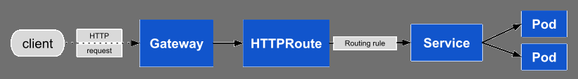

# Gateway API for Kubernetes

In this post we will go over a new project by the [SIG-NETWORK](https://github.com/kubernetes/community/tree/master/sig-network) that aims to evolve Kubernetes service networking.

I'll be using a Kubernetes v1.26 (latest at the time of this writing). The tool used to create the cluster is [kcli](https://kcli.readthedocs.io/) and the command used was:

~~~sh
kcli create kube generic -P ctlplanes=1 -P workers=1 -P ctlplane_memory=4096 -P numcpus=8 -P worker_memory=8192 -P image=fedora37 -P sdn=calico -P version=1.26 -P ingress=false -P metallb=true -P domain=linuxera.org gateway-api-cluster
~~~

## Introduction to Kubernetes Gateway API

As we said in the previous section, Gateway API is a new project by the SIG-NETWORK. This project aims to become the preferred solution for managing external traffic into a Kubernetes cluster.

Compared to traditional Ingress Controllers, Gateway API provides a more declarative and standardized approach to configuring and managing network traffic.

For example, Gateway API allows the definition and configuration for routing, load balancing, and other traffic policies in a more consistent and unified manner, regardless of the underlying infrastructure or cloud provider.

On top of that, effort has been put in making Gateway API more extensible and support a wider range of uses cases, making it a more future-proof solution for managing traffic in modern cloud-native environments.

### New APIs

Gateway API introduces new APIs to our Kubernetes clusters, you can see the APIs as well as the target personas in the image below:

[Image Source](https://gateway-api.sigs.k8s.io/)

#### GatewayClass

The infrastructure provider will offer one or more `GatewayClasses` for the user. A decoupling mechanism will implement the `Gateway` (usually a controller) from the user.

For example, the infrastructure provider could create two `GatewayClasses`:

* `internal`: Can be used to expose apps internally.
* `external`: Can be used to expose apps externally.

Then some `Gateway` will implement these `GatewayClasses` and the user don't need to know how that's implemented, instead user only chooses if the app gets externally published or not.

You can read more about the `GatewayClass` [here](https://gateway-api.sigs.k8s.io/api-types/gatewayclass/).

#### Gateway

When the cluster operator creates a `Gateway` that triggers an action in the infrastructure like:

* Call a cloud API to create a Load Balancer.
* Deploy a software load balancer in the cluster.
* etc.

The `Gateway` always has a reference to the `GatewayClass` that it implements, and at the same time the `GatewayClass` has a reference to the controller (or decoupling mechanism) that implements the `GatewayClass` itself.

The `Gateway` object defines some other properties like which ports, protocols, tls settings, etc.

You can read more about the `Gateway` [here](https://gateway-api.sigs.k8s.io/api-types/gateway/).

#### HTTPRoute

Application developers will make use of `HTTPRoutes` in order to get ingress traffic to their applications. This API specifies the routing behavior for HTTP/s requests from the Gateway listener to a service.

Below image shows how traffic flows from client to pod:

[Image Source](https://gateway-api.sigs.k8s.io/api-types/httproute/)

You can read more about the `HTTPRoute` [here](https://gateway-api.sigs.k8s.io/api-types/httproute/).

## Trying Gateway API with NGinx Gateway Controller

In this section we will be deploying all the required bits to expose an application via `HTTP/s` using `HTTPRoutes`. Three scenarios will be covered:

* Exposing an APP via HTTP.
* Blue/Green with weights.
* Exposing an APP via HTTPs.

The following software versions were used:

* Kubernetes v1.26.4
* Gateway API v0.6.2
* MetalLB v0.13.9

### Deploying the Gateway API

For this introduction we are deploying the [standard APIs](https://gateway-api.sigs.k8s.io/concepts/versioning/#release-channels-eg-experimental-standard), so we won't get support for `TCPRoute`, `TLSRoute`, etc. Only basic support for `HTTPRoute` will be available.

1. Deploy the Gateway API CRDs and admission server

    ~~~sh
    kubectl apply -f https://github.com/kubernetes-sigs/gateway-api/releases/download/v0.6.2/standard-install.yaml
    ~~~

2. If we check the pods created in the `gateway-system` namespace, we will see the admission server running:

    ~~~sh
    kubectl -n gateway-system get pods
    ~~~

    ~~~console
    NAME                                            READY   STATUS      RESTARTS   AGE
    gateway-api-admission-l2dnj                     0/1     Completed   0          30s
    gateway-api-admission-patch-sh6tw               0/1     Completed   1          30s
    gateway-api-admission-server-546bdb8747-q5jxw   1/1     Running     0          30s
    ~~~

At this point we have the Gateway API running, next step will be choosing the Gateway API implementation we want to use. You can find a list of current implementations [here](https://gateway-api.sigs.k8s.io/implementations/). For this post, we will be using the NGinx Gateway implementation.

### Deploying the NGinx Gateway Controller

The code for the controller can be found [here](https://github.com/nginxinc/nginx-kubernetes-gateway).

The instructions to deploy the controller use the commit `23092c6e1b17e91177bdb5f43bef477f90d1cc63` which is the content of the `main` branch as of April 24th.

1. Create the namespace where the controller will be deployed:

    ~~~sh
    kubectl apply -f https://raw.githubusercontent.com/nginxinc/nginx-kubernetes-gateway/23092c6e1b17e91177bdb5f43bef477f90d1cc63/deploy/manifests/namespace.yaml
    ~~~

2. Create the `njs-modules`, this is used by NGinx to implement the data plane:

    
`njs` is a subset of the JavaScript language that allows extending nginx functionality.
    

    ~~~sh
    curl -L https://raw.githubusercontent.com/nginxinc/nginx-kubernetes-gateway/23092c6e1b17e91177bdb5f43bef477f90d1cc63/internal/nginx/modules/src/httpmatches.js -o /tmp/httpmatches.js
    kubectl -n nginx-gateway create configmap njs-modules --from-file=/tmp/httpmatches.js
    rm -f /tmp/httpmatches.js
    ~~~

3. Create the `GatewayClass` that will use the nginx controller as backend:

    ~~~sh
    kubectl apply -f https://raw.githubusercontent.com/nginxinc/nginx-kubernetes-gateway/23092c6e1b17e91177bdb5f43bef477f90d1cc63/deploy/manifests/gatewayclass.yaml
    ~~~

4. Finally, deploy the NGinx Gateway Controller:

    
Container nginx-gateway is using `ghcr.io/nginxinc/nginx-kubernetes-gateway:edge` which at the time of this writing points to `ghcr.io/nginxinc/nginx-kubernetes-gateway@sha256:e67a8e8553a581404cfbf1343f60c67cd9a6c68436b7367bb1ea8fbbef862c8e`.
    

    ~~~sh
    kubectl apply -f https://raw.githubusercontent.com/nginxinc/nginx-kubernetes-gateway/23092c6e1b17e91177bdb5f43bef477f90d1cc63/deploy/manifests/nginx-gateway.yaml
    ~~~

5. After a few moments, the controller pod will be running:

    ~~~sh
    kubectl -n nginx-gateway get pods
    ~~~

    ~~~console
    NAME                             READY   STATUS    RESTARTS   AGE
    nginx-gateway-54dc684b98-xnrv8   2/2     Running   0          30s
    ~~~

6. We need to expose the gateway controller, we will be using a `LoadBalancer` service for that. In our cluster we are using `MetalLB`.

    
You can read how to deploy MetalLB on the [official docs](https://metallb.universe.tf/installation/). If you're running on a cloud provider, you should be good to go without MetalLB.
    

    ~~~sh
    kubectl apply -f https://raw.githubusercontent.com/nginxinc/nginx-kubernetes-gateway/23092c6e1b17e91177bdb5f43bef477f90d1cc63/deploy/manifests/service/loadbalancer.yaml
    ~~~

7. We should have a `Service` with an external IP set:

    ~~~sh
    kubectl -n nginx-gateway get svc
    ~~~

    ~~~console
    NAME            TYPE           CLUSTER-IP     EXTERNAL-IP       PORT(S)                      AGE
    nginx-gateway   LoadBalancer   10.107.59.82   192.168.122.240   80:30970/TCP,443:31783/TCP   7s
    ~~~

8. In order to be able to expose our applications we need proper DNS resolution, we will be configuring a wildcard record in our DNS server. In this case we're creating a record `*.apps.gateway-api.test.lab` that points to the external IP `192.168.122.240`.

    
This wildcard domain will be used when exposing our apps.
    

    ~~~sh
    dig +short anything.apps.gateway-api.test.lab
    ~~~

    ~~~console
    192.168.122.240
    ~~~

At this point we are ready to start exposing our applications with the NGinx Gateway.

### Exposing applications with the NGinx Gateway

As previously stated, the following scenarios will be covered:

* Exposing an APP via HTTP.
* Blue/Green with weights.
* Exposing an APP via HTTPs.

#### Exposing an APP via HTTP

For this scenario we are just deploying a simple app and making it available for HTTP calls.

1. Deploy the simple app:

    ~~~sh
    cat <<EOF | kubectl apply -f -
    ---
    apiVersion: v1
    kind: Namespace
    metadata:
      name: reverse-words
    ---
    apiVersion: apps/v1
    kind: Deployment
    metadata:
      name: reverse-words-blue
      namespace: reverse-words
      labels:
        app: reverse-words-blue
    spec:
      replicas: 1
      selector:
        matchLabels:
          app: reverse-words-blue
      template:
        metadata:
          labels:
            app: reverse-words-blue
        spec:
          containers:
          - name: reverse-words
            image: quay.io/mavazque/reversewords:0.27
            ports:
            - containerPort: 8080
              name: http
            env:
            - name: RELEASE
              value: "Blue"
            livenessProbe:
              httpGet:
                path: /health
                port: 8080
              initialDelaySeconds: 5
              timeoutSeconds: 2
              periodSeconds: 15
            readinessProbe:
              httpGet:
                path: /health
                port: 8080
              initialDelaySeconds: 10
              timeoutSeconds: 2
              periodSeconds: 15
    ---
    apiVersion: v1
    kind: Service
    metadata:
      labels:
        app: reverse-words-blue
      name: reverse-words-blue
      namespace: reverse-words
    spec:
      ports:
      - port: 8080
        protocol: TCP
        targetPort: http
        name: http
      selector:
        app: reverse-words-blue
      type: ClusterIP
    EOF
    ~~~

2. With the app running we will create a `Gateway` resource pointing to the NGinx Gateway Class created earlier. On top of that, it will only listen for HTTP connections on port `80`:

    
When creating `HTTPRoutes` in the `reverse-words` namespace we will reference this Gateway and the listener to be used to expose our application. We can have multiple `Gateways` per namespace, for example: One `Gateway` that exposes services using NGinx, another one that uses `HAProxy`, and a third one that uses `F5 Big IP`, etc.
    

    ~~~sh
    cat <<EOF | kubectl apply -f -
    apiVersion: gateway.networking.k8s.io/v1beta1
    kind: Gateway
    metadata:
      name: gateway
      namespace: reverse-words
      labels:
        domain: k8s-gateway.nginx.org
    spec:
      gatewayClassName: nginx
      listeners:
      - name: http
        port: 80
        protocol: HTTP
    EOF
    ~~~

3. Finally, let's create the `HTTPRoute`:

    
This `HTTPRoute` uses the `Gateway` named `gateway` in this namespace, and will use the listener `http` to publish the route. The `Service` being exposed is the `reverse-words-blue` service on port `8080`.
    

    ~~~sh
    cat <<EOF | kubectl apply -f -
    apiVersion: gateway.networking.k8s.io/v1beta1
    kind: HTTPRoute
    metadata:
      name: reversewords
      namespace: reverse-words
    spec:
      parentRefs:
      - name: gateway
        sectionName: http
      hostnames:
      - reverse-words.apps.gateway-api.test.lab
      rules:
      - backendRefs:
        - name: reverse-words-blue
          port: 8080
    EOF
    ~~~

4. We can now access our application:

    ~~~sh
    curl http://reverse-words.apps.gateway-api.test.lab
    ~~~

    ~~~console
    Reverse Words Release: Blue. App version: v0.0.27
    ~~~

#### Blue/Green with weights

In this scenario we have two versions of the same service, and we will move traffic gradually to the newer version.


This scenario relies on the application deployed on the previous section.


1. Deploy the new version of our application (`Green`)

    ~~~sh
    cat <<EOF | kubectl apply -f -
    apiVersion: apps/v1
    kind: Deployment
    metadata:
      name: reverse-words-green
      namespace: reverse-words
      labels:
        app: reverse-words-green
    spec:
      replicas: 1
      selector:
        matchLabels:
          app: reverse-words-green
      template:
        metadata:
          labels:
            app: reverse-words-green
        spec:
          containers:
          - name: reverse-words
            image: quay.io/mavazque/reversewords:0.28
            ports:
            - containerPort: 8080
              name: http
            env:
            - name: RELEASE
              value: "Green"
            livenessProbe:
              httpGet:
                path: /health
                port: 8080
              initialDelaySeconds: 5
              timeoutSeconds: 2
              periodSeconds: 15
            readinessProbe:
              httpGet:
                path: /health
                port: 8080
              initialDelaySeconds: 10
              timeoutSeconds: 2
              periodSeconds: 15
    ---
    apiVersion: v1
    kind: Service
    metadata:
      labels:
        app: reverse-words-green
      name: reverse-words-green
      namespace: reverse-words
    spec:
      ports:
      - port: 8080
        protocol: TCP
        targetPort: http
        name: http
      selector:
        app: reverse-words-green
      type: ClusterIP
    EOF
    ~~~

2. Patch the old `HTTPRoute` and add the new backend + weights:

    
Below route will send most of the request to the old service (`Blue`) and a few ones to the new one (`Green`).
    

    ~~~sh
    cat <<EOF | kubectl apply -f -
    apiVersion: gateway.networking.k8s.io/v1beta1
    kind: HTTPRoute
    metadata:
      name: reversewords
      namespace: reverse-words
    spec:
      parentRefs:
      - name: gateway
        sectionName: http
      hostnames:
      - reverse-words.apps.gateway-api.test.lab
      rules:
      - backendRefs:
        - name: reverse-words-blue
          port: 8080
          weight: 90
        - name: reverse-words-green
          port: 8080
          weight: 10
    EOF
    ~~~

3. If we try to access our application this is what we will get:

    ~~~sh
    for i in $(seq 1 10);do curl http://reverse-words.apps.gateway-api.test.lab; done
    ~~~

    ~~~console
    Reverse Words Release: Blue. App version: v0.0.27
    Reverse Words Release: Blue. App version: v0.0.27
    Reverse Words Release: Blue. App version: v0.0.27
    Reverse Words Release: Blue. App version: v0.0.27
    Reverse Words Release: Blue. App version: v0.0.27
    Reverse Words Release: Blue. App version: v0.0.27
    Reverse Words Release: Blue. App version: v0.0.27
    Reverse Words Release: Green. App version: v0.0.28
    Reverse Words Release: Blue. App version: v0.0.27
    Reverse Words Release: Blue. App version: v0.0.27   
    ~~~

4. We can update the weights, so traffic gets distributed evenly:

    ~~~sh
    kubectl -n reverse-words patch httproute reversewords -p '{"spec":{"rules":[{"backendRefs":[{"group":"","kind":"Service","name":"reverse-words-blue","port":8080,"weight":50},{"group":"","kind":"Service","name":"reverse-words-green","port":8080,"weight":50}],"matches":[{"path":{"type":"PathPrefix","value":"/"}}]}]}}' --type merge
    ~~~

5. And check the impact:

    ~~~sh
    for i in $(seq 1 10);do curl http://reverse-words.apps.gateway-api.test.lab; done
    ~~~

    ~~~console
    Reverse Words Release: Blue. App version: v0.0.27
    Reverse Words Release: Green. App version: v0.0.28
    Reverse Words Release: Blue. App version: v0.0.27
    Reverse Words Release: Blue. App version: v0.0.27
    Reverse Words Release: Blue. App version: v0.0.27
    Reverse Words Release: Blue. App version: v0.0.27
    Reverse Words Release: Green. App version: v0.0.28
    Reverse Words Release: Blue. App version: v0.0.27
    Reverse Words Release: Green. App version: v0.0.28
    Reverse Words Release: Green. App version: v0.0.28
    ~~~

6. We can move weight to `0` to remove the old service (`Blue`) from the load balancing:

    ~~~sh
    kubectl -n reverse-words patch httproute reversewords -p '{"spec":{"rules":[{"backendRefs":[{"group":"","kind":"Service","name":"reverse-words-blue","port":8080,"weight":0},{"group":"","kind":"Service","name":"reverse-words-green","port":8080,"weight":100}],"matches":[{"path":{"type":"PathPrefix","value":"/"}}]}]}}' --type merge
    ~~~

    ~~~sh
    for i in $(seq 1 10);do curl http://reverse-words.apps.gateway-api.test.lab; done
    ~~~

    ~~~console
    Reverse Words Release: Green. App version: v0.0.28
    Reverse Words Release: Green. App version: v0.0.28
    Reverse Words Release: Green. App version: v0.0.28
    Reverse Words Release: Green. App version: v0.0.28
    Reverse Words Release: Green. App version: v0.0.28
    Reverse Words Release: Green. App version: v0.0.28
    Reverse Words Release: Green. App version: v0.0.28
    Reverse Words Release: Green. App version: v0.0.28
    Reverse Words Release: Green. App version: v0.0.28
    Reverse Words Release: Green. App version: v0.0.28
    ~~~

#### Exposing an APP via HTTPs

For this scenario we are just configuring the Gateway to do TLS termination at the edge, after that we will expose our simple app via HTTPs and redirect HTTP requests to the HTTPs port.


This scenario relies on the application deployed on the previous section.


1. We need a TLS cert, let's generate a self-signed one:

    ~~~sh
    openssl req -new -newkey rsa:2048 -sha256 -days 3650 -nodes -x509 -extensions v3_ca -keyout /tmp/tls.key -out /tmp/tls.crt -subj "/C=ES/ST=Valencia/L=Valencia/O=IT/OU=IT/CN=*.apps.gateway-api.test.lab" -addext "subjectAltName = DNS:*.apps.gateway-api.test.lab"
    ~~~

2. The certificate needs to be stored in a secret:

    ~~~sh
    kubectl -n reverse-words create secret tls reversewords-gateway-tls --cert=/tmp/tls.crt --key=/tmp/tls.key
    ~~~

3. The `Gateway` needs to be updated, a new listener for the https protocol will be created on port 443. This listener will be our TLS terminator and will use the certificate we just created:

    ~~~sh
    cat <<EOF | kubectl apply -f -
    apiVersion: gateway.networking.k8s.io/v1beta1
    kind: Gateway
    metadata:
      name: gateway
      namespace: reverse-words
      labels:
        domain: k8s-gateway.nginx.org
    spec:
      gatewayClassName: nginx
      listeners:
      - name: http
        port: 80
        protocol: HTTP
      - name: https
        port: 443
        protocol: HTTPS
        tls:
          mode: Terminate
          certificateRefs:
          - kind: Secret
            name: reversewords-gateway-tls
            namespace: reverse-words
    EOF
    ~~~

4. Let's remove the old `HTTPRoute` and create a new one exposing the app via HTTPs:

    ~~~sh
    kubectl -n reverse-words delete httproute reversewords
    ~~~

    ~~~sh
    cat <<EOF | kubectl apply -f -
    apiVersion: gateway.networking.k8s.io/v1beta1
    kind: HTTPRoute
    metadata:
      name: reversewords
      namespace: reverse-words
    spec:
      parentRefs:
      - name: gateway
        sectionName: https
      hostnames:
      - reverse-words.apps.gateway-api.test.lab
      rules:
      - backendRefs:
        - name: reverse-words-green
          port: 8080
    EOF
    ~~~

5. We can now access our app via https:

    ~~~sh
    curl -k https://reverse-words.apps.gateway-api.test.lab
    ~~~~

    ~~~console
    Reverse Words Release: Green. App version: v0.0.28
    ~~~

6. If we try to access the app via http:

    ~~~sh
    curl http://reverse-words.apps.gateway-api.test.lab
    ~~~

    
Our `HTTPRoute` does not expose the app via http, this is expected.
    

    ~~~console
    <html>
    <head><title>404 Not Found</title></head>
    <body>
    
<h1>404 Not Found</h1>

    

nginx/1.23.4

    </body>
    </html>
    ~~~

7. Usually you want to redirect users hitting the HTTP endpoint to the HTTPs endpoint, lets configure that:

    
We need to create a new `HTTPRoute`, but if you take a closer look you will not see any backends being referenced, instead we are applying a `RequestRedirect` filter to tell the client to go look the HTTPs endpoint. More on filters [here](https://gateway-api.sigs.k8s.io/v1alpha2/guides/http-redirect-rewrite/).
    

    ~~~sh
    cat <<EOF | kubectl apply -f -
    apiVersion: gateway.networking.k8s.io/v1beta1
    kind: HTTPRoute
    metadata:
      name: reversewords-tls-redirect
      namespace: reverse-words
    spec:
      parentRefs:
      - name: gateway
        sectionName: http
      hostnames:
      - reverse-words.apps.gateway-api.test.lab
      rules:
      - filters:
        - type: RequestRedirect
          requestRedirect:
            scheme: https
            port: 443
    EOF
    ~~~

8. If we access the HTTP endpoint, we're told to go somewhere else:

    ~~~sh
    curl http://reverse-words.apps.gateway-api.test.lab
    ~~~

    ~~~console
    <html>
    <head><title>302 Found</title></head>
    <body>
    
<h1>302 Found</h1>

    

nginx/1.23.4

    </body>
    </html>
    ~~~

9. If we tell `curl` to follow redirects (`-L`):

    ~~~sh
    curl -Lk http://reverse-words.apps.gateway-api.test.lab
    ~~~

    ~~~console
    Reverse Words Release: Green. App version: v0.0.28
    ~~~

## Closing Thoughts

Gateway API is a step forward in terms of standardization, allowing better integrations with 3rd party providers as well as providing a more general API for proxying that can be used for more protocols than just HTTP.

It's important to keep in mind that Gateway API will not be replacing the Ingress API, instead as stated above it will be used to enable proxying of other protocols on top of HTTP like gRPC, TCP, etc.

## Useful Resources

* https://gateway-api.sigs.k8s.io/
* https://gateway-api.sigs.k8s.io/v1alpha2/guides/
* https://gateway-api.sigs.k8s.io/api-types/httproute/
* https://gateway-api.sigs.k8s.io/api-types/referencegrant/
* https://github.com/nginxinc/nginx-kubernetes-gateway/blob/main/docs/installation.md