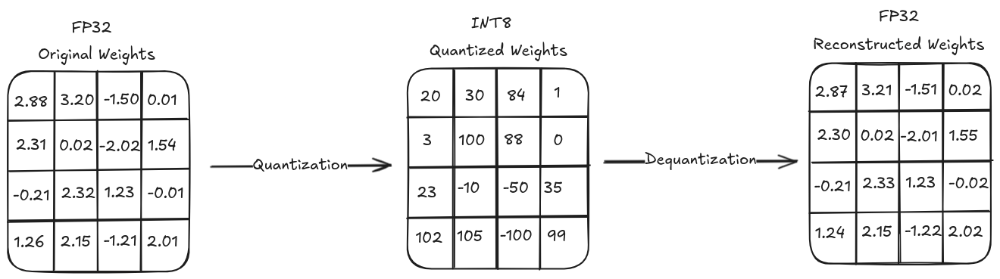
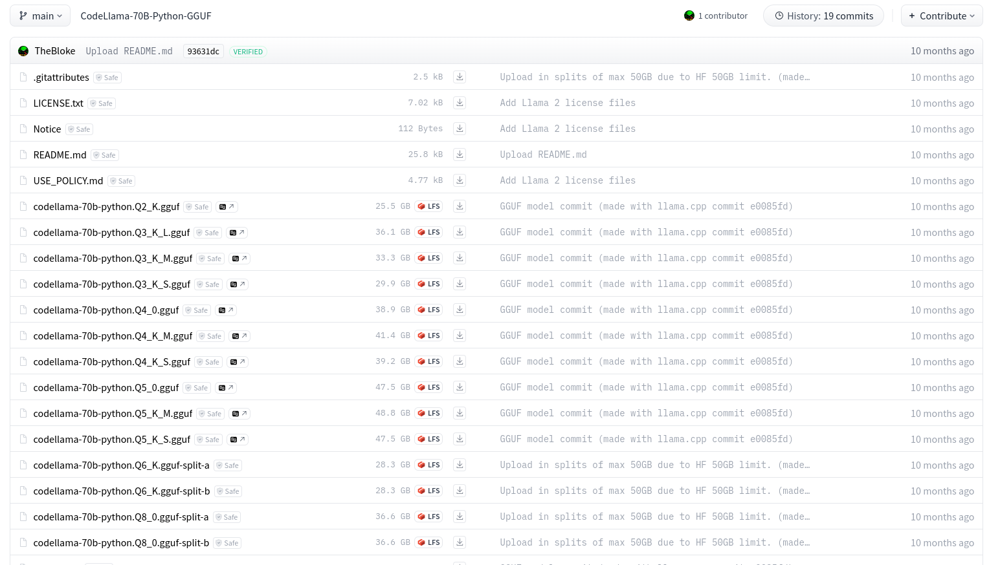

# Introduction to LLM concepts

In this post, I'll cover various LLM concepts and the questions I asked myself while diving deep into the world of LLMs. I expect this post to be updated as I continue to learn more things around LLMs.


This post is the result of my exploratory work on LLMs. While I’ve made a strong effort to ensure the information is accurate, I’m far from an expert on the topic, and some details may not be entirely correct. If you notice anything missing or inaccurate, please leave a comment!


## General LLM Concepts and Questions

This section describes general concepts and questions around Large Language Models.

### What's a Large Language Model (LLM)?

A Large Language Model (LLM) is an AI system trained on vast amounts of text data to understand and generate human-like language. Using deep learning, specifically transformer architectures, LLMs can answer questions, summarize text, generate content, and more. They predict the most likely next word based on context.

### What's the difference between a `Base` and an `Instruct` model?

A base model predicts the next word, an instruct model has been fine-tuned to predict the next word in a conversation between a user and a helpful assistant and specifically to follow instructions. There are other types like chat models that are fine-tuned to follow a conversation in a chat-like mode with a given format, etc.

You could make a base model follow instructions but that requires configuring the model via prompts to do so.

Usually, base models are used for fine-tune your model based on the base one.

We can make a base model behave like an instruct model by formatting our prompts in a consistent way that the model can understand. That's done via chat templates. If you want to learn more about chat templates, [read this](https://huggingface.co/docs/transformers/en/chat_templating). You can see the chat template for an instruct model in the `tokenizer_config.json` ([example](https://huggingface.co/HuggingFaceTB/SmolLM2-135M-Instruct/blob/main/tokenizer_config.json#L146)).

| **Aspect**               | **Base Models**                       | **Instruct Models**                       |
| ------------------------ | ------------------------------------- | ----------------------------------------- |
| **Training Objective**   | General language modeling.            | Fine-tuned for instruction following.     |
| **Focus**                | Broad and generic text understanding. | Task-specific, user-centric interactions. |
| **Performance**          | Literal, unrefined responses.         | Context-aware, tailored responses.        |
| **Safety and Alignment** | Lower alignment with human values.    | Higher alignment due to RLHF.             |
| **Examples of Usage**    | Pre-training for fine-tuning tasks.   | User-facing applications like chatbots.   |

RLHF -> Reinforcement Learning from Human Feedback

- **Base Models**: Useful as a starting point for further fine-tuning for specific tasks.
- **Instruct Models**: Ideal for deployment in interactive environments where users provide natural-language instructions.

You may want to use base when you train the model yourself or you want to do purely text/code continuation.

### What are Parameters in a LLM Model?

In a Large Language Model (LLM), parameters refer to the numerical values within the model that determine how it processes and generates text. These parameters are the weights and biases of the neural network, which are adjusted during the training process.

### Teacher vs Critic vs Judge Model

#### Teacher Model

A teacher model in many cases is a large, high-performing model whose outputs are used to train a smaller, more efficient student model. This process (called knowledge distillation) typically involves having the teacher model generate "soft labels" or guidance on either the same dataset or additional unlabeled data, which helps the student learn more nuanced patterns. A teacher model can also be used to generate synthetic data from a curated dataset (i.e: one carefully selected or labeled by humans).

#### Critic Model

A critic model is designed to evaluate or critique the output of another model. Its role is typically focused on assessing the quality, relevance, accuracy, or coherence of generated outputs and identifying areas of improvement.

Critic models are often used during training to evaluate outputs from the teacher model.

#### Judge Model

A judge model is designed to evaluate and rank the performance of multiple outputs. It acts more as an arbiter than a feedback provider, making decisions about which output is "better" according to predefined criteria. Depending on the setup, its role can overlap with or complement that of a critic model.

Judge models can sometimes be trained on human preference data, which helps them simulate human judgement more closely.

##### LLM as a Judge

Using LLMs as judges is a powerful solution to asses outputs in a human way, without requiring costly human time. The idea is simple: ask an LLM to do the grading for you.

You can read more about this in [this hugging face cookbook](https://huggingface.co/learn/cookbook/en/llm_judge).

#### Critic and Judge models collaboration

In advanced LLM setups, critic and judge models often work together:

1. **Critic** improves candidate outputs by iterating over feedback.
2. **Judge** evaluates the improved outputs to decide the final response.

This dynamic can be crucial in applications where **fine-tuned outputs**, such as accurate medical advice, high-quality creative writing, or nuanced technical analysis, are required.

### RAG vs Fine Tuning

The difference between RAG and fine-tuning is that RAG augments a natural language processing (NLP) model by connecting it to an organization’s proprietary database, while fine-tuning optimizes deep learning models for domain-specific tasks. RAG and fine-tuning have the same intended outcome: enhancing a model’s performance to maximize value for the enterprise that uses it.

RAG uses an organization’s internal data to augment prompt engineering, while fine-tuning retrains a model on a focused set of external data to improve performance.

When we talk about fine-tuning most of the time we refer to parameter-efficient fine-tuning (PEFT) which focuses on tuning only the relevant parameters to make the mode more effective in a certain domain, this helps keeping training costs low.

| **Aspect**            | **RAG (Retrieval-Augmented Generation)**                   | **Fine-Tuning**                                         |
| --------------------- | ---------------------------------------------------------- | ------------------------------------------------------- |
| **Knowledge Source**  | External, dynamically retrieved.                           | Internal, baked into the model’s weights.               |
| **Adaptation Method** | Combines retrieval and generation dynamically.             | Updates model weights with new training data.           |
| **Scalability**       | Scales easily with growing knowledge bases.                | Requires retraining for new domains.                    |
| **Flexibility**       | Can adapt to changing information in real-time.            | Static after training; requires retraining for updates. |
| **Cost and Time**     | Requires infrastructure for retrieval; no retraining cost. | Computationally expensive and time-consuming.           |
| **Performance**       | Dependent on the quality of the retrieval system.          | Highly accurate for specific tasks if trained well.     |
| **Use Cases**         | Open-domain, dynamic tasks needing current data.           | Fixed-domain, static tasks requiring precision.         |

### Evaluating Models

In order to evaluate a LLM performance there are different benchmarks that can be used, there are several benchmarks available, two of the most common ones are:

- MMLU: Massive Multitask Language Understanding, tests a model’s proficiency across a wide range of subjects, ensuring broad knowledge coverage. 
- MATH: Evaluates mathematical problem-solving abilities, ensuring that models can handle numerical and logical challenges

### What is quantization?

Quantization is a compression technique in order to reduce model's size. It maps high precision values to lower precision values for the model's weights and activations. This compression has an impact on the model accuracy, in some cases comparable results can be achieve with lower precision.

The way it works is by representing a range of full precision float32 numbers (FP32) in half precision float16 numbers (FP16), and sometimes even integer numbers like int 4 bits (INT4). Usually quantization is done from FP32 to INT8.

For example, if we have a 2B parameter model with half precision FP16 where each parameter takes 16 bits (2bytes), it means the model will weight ~4GB:

`(2000000000*2)/1024/1024/1024 = 3.7`

More info available [here](https://symbl.ai/developers/blog/a-guide-to-quantization-in-llms/).

### What is a distilled model?

A distilled model is a smaller, more efficient version of a larger model, trained using a technique called knowledge distillation. The goal is to retain as much of the original model's performance as possible while reducing its size and computational requirements.

#### How Knowledge Distillation Works

A large model (teacher) generates outputs on a dataset.

A smaller model (student) is trained to mimic the outputs of the teacher model, often learning from both:

- The original dataset.
- The teacher model’s predictions, probabilities, or reasoning steps.

The student model achieves similar accuracy with fewer parameters, making it faster and cheaper to use.

This approach is common in LLMs to create lighter, optimized versions for deployment in real-world applications with limited computing power.

### What are tokens in the context of LLMs?

We can think of a token as if it was a word, but a token is  not always a whole word. For example, English has around ~600k words, while an LLM might have a vocabulary of around ~32k tokens (i.e: llama2). 

Tokenization works on sub-words units that can be combined. For example, the tokens "play" and "ful"  can be combined to form "playful". Or we can append "ed" to form "played".

You can see a tokenizer in action in this [hugging face tokenizer playground](https://huggingface.co/spaces/Xenova/the-tokenizer-playground).

LLMs use special tokens specific to the models to open and close the structured components of its generation. The most important special token is the End of sequence token (EOS). For example SmolLM2 from hugging face uses the following EOS token `<|im_end|>`. You can see the special tokens for models in the `tokenizer_config.json`.

[Example for SomlLM2](https://huggingface.co/HuggingFaceTB/SmolLM2-135M-Instruct/blob/main/tokenizer_config.json).

LLMs will predict continue predicting words until the next word with the highest score is the EOS token.

You can see how the decoding process works [here](https://huggingface.co/spaces/agents-course/decoding_visualizer). And a more advanced strategy [here](https://huggingface.co/spaces/agents-course/beam_search_visualizer).

### What is the context window/context length/model max length?

It's the maximum number of tokens the model can process in a single input sequence (including both the prompt and any output generated during a single pass).

Let's say we have a context window of 2048, if we have one input that takes 1000, we have 1048 left for the model to reply. 

Remember that LLMs doesn't have memory, if you're in a chat and the model is remembering the conversation is because on each iteration the previous context is being sent as well.

Keep in mind that the greater the context length is, the more memory it takes to run the model.

 The maximum context window that a model can handle is often found in the `tokenizer_config.json` and/or in the `config.json` files for safetensors models.

You can look for `model_max_length` in `tokenizer_config.json` and if the value doesn't make sense, look for `max_position_embeddings` in `config.json`.

The values in these files may be higher than a power-of-2 size, so for example if the setting says `131072`, that would be `128k` model max length.

An alternative is looking for this information in [LLM Explorer](https://llm.extractum.io/).

### What is the embedding size?

The embedding size refers to the number of dimensions used to represent each token as a numerical vector. For example, if a model has an embedding size of 768, each token is represented as a 768-dimensional vector.

Larger embedding sizes capture more nuanced meanings and relationships between words, improving model performance.

The larger the embedding size is, the larger the computational requirements are.

### What are weights and activations?

Weights are trainable parameters that a model learns during training, defining the strength of connections between neurons across different layers. They control how much influence input data has on each neuron's output. In LLMs, such as transformer models, weights capture complex language patterns like grammar, context, and semantics by determining relationships between words and distributing attention.

Activations, on the other hand, are the outputs produced by neurons after applying an activation function (e.g., ReLU, Sigmoid, or Tanh) to the weighted sum of inputs. They introduce non-linearity, enabling the model to learn and represent complex patterns that linear functions cannot capture. In LLMs, activations help the model represent nuanced aspects of language, such as the relative importance of words or phrases in a given context.

Together, weights and activations work in tandem: weights adjust the flow and influence of information through the network during training, while activations determine the processed outputs at each neuron, ultimately allowing models to perform tasks like text generation, translation, and summarization effectively.

### Safetensors vs GGUF models

Both are common formats for sharing LLM models, we can think of safetensors as the raw files, more convenient for fine-tuning and tinkering, while the gguf can be seen as a binary format more convenient for sharing and consume. 

### Required vRAM for LLM Models

A basic formula to estimate vRAM usage is:

Number of parameters x (Precision / 8 ) x 1.2

For example for a 2B parameter using FP32

> This calculation assumes a maximum sequence length of 512, a batch size of 8, and the use of a single GPU.

`2000000000 x (32/8) x 1.2 / 1024 / 1024 / 1024 = 8.9`

Some models also publish the amount of memory they take, for example Mistral publishes sizes [here](https://docs.mistral.ai/getting-started/models/weights/#sizes).

These estimations are for inference, training takes more memory.

There are also some tools to know if you can run a given model in your hardware:

- https://huggingface.co/spaces/Vokturz/can-it-run-llm
- https://vram.asmirnov.xyz/
- https://rahulschand.github.io/gpu_poor

### LLM Models Naming

There is no naming convention, but the more common way of naming models is like this:

For example given the name `codellama-70b-python.Q4_K_S.gguf` we can tell:

- `70B` --> 70 billion parameters.
- `Q4` --> Quantization level. The lower the number, the lower the memory required (and also the precision).
- `_0|_1|_K` --> Rounding method used for the weights.
- `_S|_M|_L` --> Size category from small to large. The lower the letter, the lower the memory required (and also the precision).

#### What does it mean model names like 8x7B

It means the model is a mixture of experts of 8 models. Each model with 7B parameters.

### Padding in LLM Models

In the context of LLMs, padding refers to the practice of adding dummy tokens (usually a special `<PAD>` token) to sequences to make them all the same length. Padding is used in situations where batches of text sequences need to be processed together.

For example:

- Given sentences of varying lengths like `["Hello", "How are you?", "Good morning"]`, they might be padded to a common length (e.g., 3 tokens) as:

~~~json
["Hello", "<PAD>", "<PAD>"]
["How", "are", "you?"]
["Good", "morning", "<PAD>"]
~~~

Padding helps with:

1. **Batch Processing**: Modern LLMs are highly parallelized and operate more efficiently when sequences are grouped and processed together in batches. Padding ensures all sequences in a batch have the same length.
2. **Fixed-Length Input**: Many models expect fixed-length input tensors (e.g., `max_length`), so padding helps conform variable-length data to this requirement.
3. **Efficient GPU Utilization**: Padding aligns data to the tensor shapes required by hardware accelerators (like GPUs/TPUs) to optimize memory and compute usage.

#### What Are Padding-Free LLM Models?

Models designed to eliminate the need for padding by processing sequences of varying lengths more dynamically. These models do not require all input sequences to be the same length and instead handle variable-length data directly.

Padding free helps with:

- **Efficiency**: Avoiding padding minimizes redundant computations, leading to faster processing.
- **Memory Usage**: Padding-free models save memory by not storing unnecessary padding tokens.
- **Scalability**: These models are more adaptable to varying sequence lengths, especially for real-time or online processing tasks.

### Prompts

Prompts are the text inputs provided to a large language model (LLM) that guide its responses. They can be simple questions, detailed instructions, or context-setting narratives. The design and clarity of a prompt directly influence the quality and relevance of the generated output. In essence, prompts tell the model what to do, framing the task and setting the context for the answer.

#### System Prompt

The system prompt is an instruction provided by the system to guide the behavior of a language model. It sets the context, defines roles, and establishes rules for how the model should respond during an interaction. This prompt is usually hidden from the end user but is crucial in shaping the overall output and ensuring consistency in the model's behavior.

When running LLMs in your own infrastructure you can define your own system prompts. While this is often hidden from the end user, there are models such as Claude, [publishing their system prompt](https://docs.anthropic.com/en/release-notes/system-prompts).

#### Chain of Thought / Reasoning Models

New reasoning models use chain-of-thought techniques, prompting the model to generate intermediate reasoning steps before providing a final answer. Unlike regular models that generate outputs in one go, these models break down the problem into smaller, logical steps. This approach improves accuracy and transparency, especially for complex tasks requiring multi-step reasoning and logical deduction.

##### No CoT vs Zero-shot CoT vs Manual CoT

###### No CoT

In this approach, the model is given the question without any guidance on reasoning or intermediate steps. The model is expected to generate an answer directly without an explicit chain of thought.

###### Zero-shot CoT

Here, a simple prompt like "Think step by step" is added to the question. This minimal instruction encourages the model to generate a chain of thought implicitly, but without detailed guidance on how to structure its reasoning.

This is also referred as Re-Act (Reasoning Act) approach.

Prompting the model to think "step by step" encourages the decoding process toward next tokens that generate a plan, rather than a final solution.

###### Manual CoT

This method involves providing detailed, step-by-step instructions or examples that illustrate the desired reasoning process. By showing how to break down and solve similar problems, manual CoT guides the model explicitly on structuring its chain of thought to arrive at an answer.

### LLM Agents

LLM agents are programs that combine one or more large language models with various tools—such as APIs, databases, or knowledge sources—to analyze inputs, reason through tasks, and execute actions or automations autonomously. Their primary use case is to streamline and automate complex workflows by integrating natural language understanding with practical tool usage.

When deploying these agents, it’s crucial to implement robust guardrails. These may include action constraints, monitoring mechanisms, fail-safes, and ethical guidelines to prevent unintended behavior and ensure safe, reliable operation.

When building agents there are no-code and pro-code alternatives, for example:

No-code: https://n8n.io/ / https://github.com/n8n-io/n8n

Pro-code: https://www.langchain.com/langgraph / https://github.com/langchain-ai/langgraph

Hugging Face course on AI Agents: https://huggingface.co/learn/agents-course/unit0/introduction

#### Example use cases

An agent that monitors system logs for errors and tries to fix stuff before it breaks. It analyzes the content of the log, checks if it has a solution for that error in its knowledge base and runs the tools for fixing it. If it doesn't know how to fix it, analyzes the log and transforms it to natural language, after that it opens a support case and routes it to the proper team.

### Model Context Protocol (MCP)

The Model Context Protocol is an open standard that enables developers to build secure, two-way connections between their data sources and AI-powered tools. The architecture is straightforward: developers can either expose their data through MCP servers or build AI applications (MCP clients) that connect to these servers.

Learn more in the [Anthropic announcement](https://www.anthropic.com/news/model-context-protocol), and [official docs](https://modelcontextprotocol.io/introduction). And check [available servers upstream](https://github.com/modelcontextprotocol/servers).

## LLM Training and Fine-Tuning Concepts

This section describes general concepts around LLM Training and Fine-Tuning.

### Synthetic Data Generation (SDG)

We use SDG for generating training data using what is called a teacher model. The teacher model generates further training data based on the human-crafted training data.

In InstructLab there is a SDG 1.5 Pipeline that adds a Critic model that filters, analyzes, critiques, plans, revises and judges the a first draft of generated data and generates the final training data set.

You can read more on how InstructLab does SDG [here](https://www.redhat.com/en/blog/how-instructlabs-synthetic-data-generation-enhances-llms).

### Overfitting and Underfitting

We say a model is overfitted when it  becomes too complex and starts to memorize the training data instead of learning the underlying patters. It will perform extremely well on the training data but will struggle with unseen data. On the other hand a model is underfitted when it lacks the capacity to graps intricate patterns. It will poorly perform with the training data as well as with unseen data.

### Required number of epochs

Epochs is the number of runs that are repeated on the same data set. Training with high epochs usually end up with model overfitting.

There is no magic number and each model will require different number of epochs, you can use benchmarks to see how the model performs. People tend to say 3 to 6 epochs is enough for fine tuning. For example, instruct-gpt from OpenAI [was trained (not fine-tuned) on 16 epochs](https://x.com/abacaj/status/1748812961441886433).

### Effective Batch Size

Refers to the total number of training examples processed in one **update step** of the model's parameters. It takes into account both the **batch size per device** (or per GPU/TPU) and the **gradient accumulation** across multiple forward and backward passes.