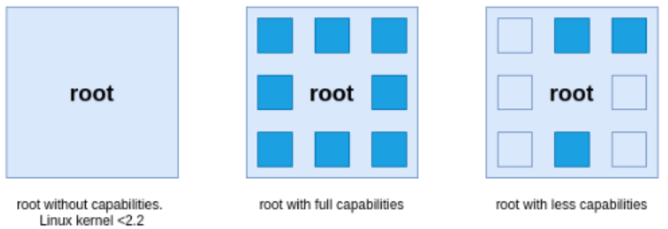
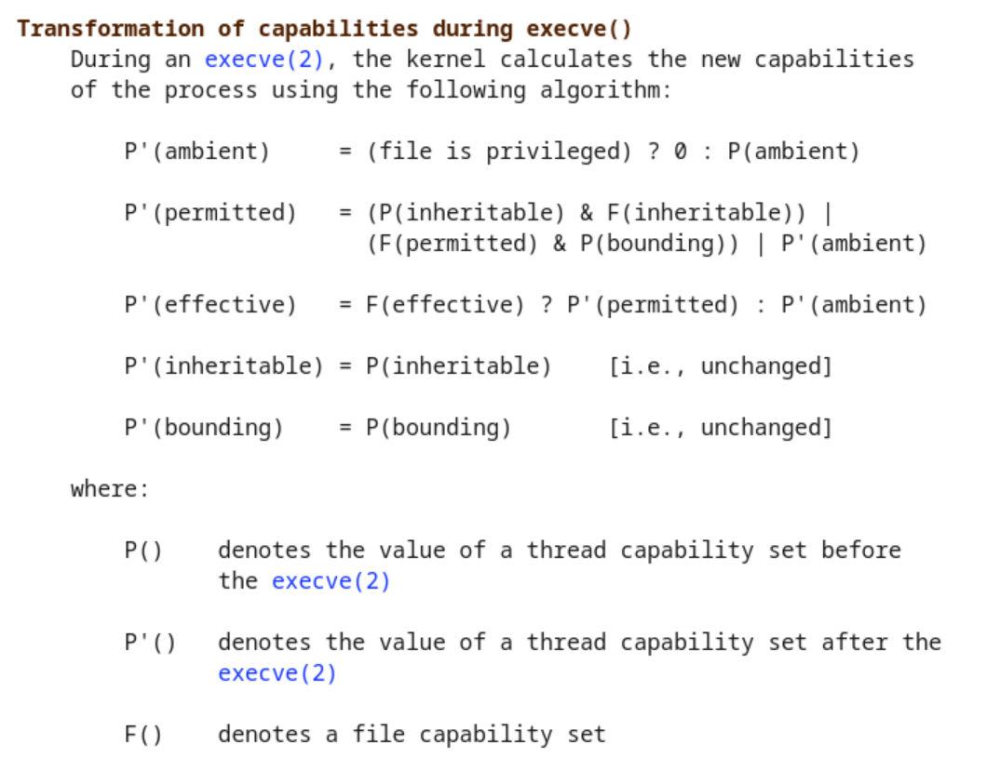

# Introducción a la seguridad en contenedores

---

## Mario Vázquez

<!-- -->

### Solutions Engineer
### Red Hat - Telco Engineering

<!-- .slide: style="text-align: left;"> -->
<i class="fa-solid fa-globe"></i><a href="https://linuxera.org">  linuxera.org</a> 
<i class="fa-solid fa-envelope"></i>  mario@redhat.com 
<i class="fa-brands fa-twitter"></i><a href="https://twitter.com/mvazce">  @mvazce</a> 
<i class="fa-brands fa-github"></i><a href="https://github.com/mvazquezc">  @mvazquezc</a> 
<i class="fa-brands fa-linkedin-in"></i><a href="https://www.linkedin.com/in/mariovazquezcebrian/">  @mariovazquezcebrian</a>

---

## Objetivo de la presentación

<!-- .slide: style="text-align: left; font-size: 18px;"> -->
- Conocer qué son y para qué se utilizan las _capabilities_ de Linux. 
- &shy;<!-- .element: class="fragment" data-fragment-index="1" --> Conocer cómo se utilizan las _capabilities_ en los contenedores. 
- &shy;<!-- .element: class="fragment" data-fragment-index="2" --> Conocer qué son y para qué se utilizan los _Secure Compute Profiles (Seccomp)_.
- &shy;<!-- .element: class="fragment" data-fragment-index="3" --> Conocer cómo podemos crear nuestros propios perfiles _seccomp_.
- &shy;<!-- .element: class="fragment" data-fragment-index="4" --> Conocer cómo podemos utilizar a nuestro favor las _capabilities_ y los perfiles _seccomp_ en entornos Kubernetes. 

---

# Linux _Capabilities_

---

## Linux _Capabilities_
<!-- .slide: style="text-align: left; font-size: 18px;"> -->

- A la hora de realizar comprobaciones de permisos, las implementaciones de UNIX tradicionales distinguían entre dos tipos de procesos:

  - Procesos Privilegiados: Su _effective user ID_ es **0**, conocido también como **superuser** o **root**.
  - Procesos No-Privilegiados: Su _effective user ID_ no es **0**.

- Los procesos privilegiados se saltan todas las comprobaciones de permisos del Kernel.
- Los procesos no privilegiados están sujetos a una comprobación de todos sus permisos basándose en los credenciales del proceso, habitualmente, su _effective UID_, _effective GID_ y grupos suplementarios.
- En el Kernel 2.2, Linux dividió los privilegios tradicionalmente asociados al **superusuario** en distinas unidades, conocidas como _capabilities_, las cuales pueden ser activadas o desactivadas de manera independientemente.
- Las _capabilities_ son un atributo de cada hilo.  

---

## Linux _Capabilities_
<!-- .slide: style="text-align: left; font-size: 18px;"> -->

- Ejemplos de capabilities:

  - **_NET_RAW_**: Permite usar _sockets_ _RAW_ y _PACKET_.
  - **_CHOWN_**: Permite hacer cambios arbitrarios a _UIDs_ y _GIDs_ de ficheros.
  - **_NET_ADMIN_**: Permite varias operaciones relacionadas con la administración de redes.
  - **_NET_BIND_SERVICE_**: Permite hacer _bind_ a un _socket_ de un puerto bien conocido (también conocidos como privilegiados, < 1024).
  - **_SYS_TIME_**: Permite modificar el reloj del sistema.

- Algunas de estas _capabilities_ están habilitadas por defecto en el _container runtime_. Por ejemplo, podemos ver las _capabilities_ habilitadas por defecto en [CRI-O v1.30](https://github.com/cri-o/cri-o/blob/v1.30.0/internal/config/capabilities/capabilities_linux.go#L15-L27) o en [ContainerD v1.7](https://github.com/containerd/containerd/blob/release/1.7/oci/spec.go#L115-L132).
- Las _capabilities_ habilitadas por defecto a través del runtime se asignan a cada contenedor en caso de que el usuario no añada o quite _capabilities_ adicionales.
- Conocer qué _capabilities_ son necesarias para una aplicación require que el desarrollador tenga conocimientos respecto a qué operaciones privilegiadas necesita su aplicación. No hay una herramienta mágica que te diga qué capabilities son necesarias para tu aplicación.

---

## Linux _Capabilities_ - _Thread Capability Sets_
<!-- .slide: style="text-align: left; font-size: 18px;"> -->

Como hemos dicho anteriormente, las _capabilities_ son un atributo de cada hilo, por lo tanto, cada hilo tiene los siguientes _capabilities sets_ que contienen cero o más _capabilities_.

<table align="left">
<tr>
<td><b>Permitted Set</b></td>
<td>
Superset que limita las <em>effective capabilities</em> que un hilo puede asumir. También limita las <em>capabilities</em> que pueden ser añadias al <em>inheritable set</em> por un hilo que tenga la <em>capability</em> <b>SETCAP</b> en su <em>effective set</em>. Si un hilo elimina una <em>capability</em> de su <em>permitted set</em>, no podrá volver adquirir esa <em>capability</em> a no ser que la obtenga mediante una llamada <em>execve</em> a un binario con <em>SETUID</em> o que llame a un binario que tenga esa <em>capability</em> como <em>permitted</em> en su <em>file capability set</em>.
</td>
</tr>
<tr>
<td><b>Inheritable Set</b></td>
<td>
<em>Capabilities</em> que se conservan a través de una llamada <em>execve</em>. Las <em>inherited capabilities</em> permanecen heredables cuando ejecutamos cualquier programa, y son añadidas al <em>permitted set</em> cuando ejecutamos un programa que tiene una de las <em>capabilities</em> presentes en este set también como una <em>inheritable capability</em> a nivel de <em>file capability</em>. Hay que tener en cuenta, que las <em>inheritable capabilities</em> no se preservan generalmente a través de una llamada <em>execve</em> cuando el programa se ejecuta como no-root. Para estos casos de uso, hay que usar <em>ambient capabilities</em>.
</td>
</tr>
<tr>
<td><b>Effective Set</b></td>
<td>
Lista de <em>capabilities</em> utilizada por el Kernel para realizar comprobaciones de permisos para el hilo.
</td>
</tr>
<tr>
<td><b>Bounding Set</b></td>
<td>
Mecanismo utilizado para limitar qué <em>capabilities</em> se pueden ganar durante una llamada <em>execve</em>.
</td>
</tr>
<tr>
<td><b>Ambient Set</b></td>
<td>
<em>Capabilities</em> que son preservadas a través de una llamada <em>execve</em> desde un hilo que no es privilegiado. Para que una <em>capability</em> pueda ser <em>ambient</em>, requiere de estar presente tanto en el <em>permitted</em> como en el <em>inheritable</em> set. Al ejecutar un programa que cambia el UID o GID (gracias al SETUID/SETGID) o al ejecutar un programa que tiene <em>file capabilities</em> el <em>ambient set</em> se limpia automaticamente. Las <em>ambient capabilities</em> se añaden al <em>permitted</em> y al <em>effective</em> set cuando el programa utiliza la llamada <em>execve</em>.
</td>
</tr>
</table>

---

## Linux _Capabilities_ - _File Capability Sets_
<!-- .slide: style="text-align: left; font-size: 18px;"> -->

Además de las _thread capabilities_, también tenemos las _file capabilities_, las cuales son asignadas a un fichero ejecutable el cual obtendrá dichas _capabilities_ en su hilo cuando se ejecute. Estas _capabilities_ se almacenan usando los atributos extendidos de los ficheros. Hay tres _capability sets_ que podemos configurar.

<table align="left">
<tr>
<td><b>Permitted Set</b></td>
<td>
<em>Capabilities</em> permitidas para el hilo, independientemente de las definidias a nivel de <em>inheritable capabilities</em> del hilo.
</td>
</tr>
<tr>
<td><b>Inheritable Set</b></td>
<td>
<em>Capabilities</em> a las cuales se le aplica una regla <em>AND</em> junto con las <em>inheritable capabilities</em> del hilo para determinar cuáles de las <em>inheritable capabilities</em> se habilitan en el <em>permitted set</em> del hilo después del <em>execve</em>.
</td>
</tr>
<tr>
<td><b>Effective Set</b></td>
<td>
Esto no es un <em>set</em> en sí mismo, en su lugar es solo un bit. Si está habilitado, durante una llamada <em>execve</em> todas las <em>capabilities</em> que forman parte del <em>permitted set</em> del hilo se añaden al <em>effective set</em>. En caso contrario, después del <em>execve</em>, ninguna de las <em>capabilities</em> del <em>permitted set</em> serán añadidas al <em>effective set</em>. Cuando habilitamos una <em>file capability</em> en el <em>effective set</em>, esta <em>capability</em> se añadirá de manera automática al <em>permitted set</em> del hilo.
</td>
</tr>
</table>

---

## Demo

### _Capabilities_ &nbsp;en Contenedores

------

### Demo 1 - Obtener las _thread capabilities_ &nbsp;de un contenedor
<!-- .slide: style="text-align: left; font-size: 18px;"> -->

1. Vamos a ejecutar un contenedor de pruebas. Este contenedor tiene una aplicación que escucha en un puerto (8080 por defecto), aunque lo del puerto no es importante por ahora:

<pre><code>podman run -d --rm --name reversewords-test quay.io/mavazque/reversewords:latest</code></pre> <!-- .element: class="fragment" data-fragment-index="2" -->

2. &shy;<!-- .element: class="fragment" data-fragment-index="3" --> Podemos ver las _capabilities_ de un proceso a través del sistema de archivos _/proc_:

<pre><code># Obtener el PID de un contenedor específico
CONTAINER_PID=$(podman inspect reversewords-test --format {{.State.Pid}})
# Obtener capabilities para un PID específico
grep Cap /proc/${CONTAINER_PID}/status
</code></pre> <!-- .element: class="fragment" data-fragment-index="4" -->

3. &shy;<!-- .element: class="fragment" data-fragment-index="5" --> Las _capabilities_ se reportan en formato hexadecimal. Podemos utilizar la herramienta _capsh_ para decodificar las _capabilities_:

<pre><code>capsh --decode=00000000800405fb</code></pre> <!-- .element: class="fragment" data-fragment-index="6" -->

4. &shy;<!-- .element: class="fragment" data-fragment-index="7" --> Los gestores de contenedores, como Podman, nos permiten obtener las _capabilities_ también:

<pre><code>podman inspect reversewords-test --format {{.EffectiveCaps}}</code></pre> <!-- .element: class="fragment" data-fragment-index="8" -->

5. <!-- .element: class="fragment" data-fragment-index="9" --> Por último, paramos el contenedor:

<pre><code>podman stop reversewords-test</code></pre> <!-- .element: class="fragment" data-fragment-index="10" -->

------

### Demo 2 - _Capabilities_ &nbsp;de un contenedor ejecutándose con root UID (0) vs UID no-root
<!-- .slide: style="text-align: left; font-size: 18px;"> -->

1. Vamos a ejecutar un contenedor con root UID y obtendremos sus capabilities:

<pre><code>podman run --rm -it --user 0 --name reversewords-test quay.io/mavazque/reversewords:ubi8 grep Cap /proc/1/status</code></pre> <!-- .element: class="fragment" data-fragment-index="1" -->

2. &shy;<!-- .element: class="fragment" data-fragment-index="2" --> Podemos ver cómo los sets _permitted_, _effective_ y _bounding_ han sido configurados por el runtime automáticamente y decodificarlos con _capsh_:

<pre><code>CapInh:	0000000000000000
CapPrm:	00000000800405fb
CapEff:	00000000800405fb
CapBnd:	00000000800405fb
CapAmb:	0000000000000000</code></pre> <!-- .element: class="fragment" data-fragment-index="2" -->
<pre><code>capsh --decode=00000000800405fb</code></pre> <!-- .element: class="fragment" data-fragment-index="2" -->

3. <!-- .element: class="fragment" data-fragment-index="3" --> Ahora podemos hacer lo mismo, pero ejecutando el contenedor con un UID no-root:

<pre><code>podman run --rm -it --user 1024 --name reversewords-test quay.io/mavazque/reversewords:ubi8 grep Cap /proc/1/status</code></pre> <!-- .element: class="fragment" data-fragment-index="4" -->

4. &shy;<!-- .element: class="fragment" data-fragment-index="5" --> En este caso, podemos ver cómo los sets _permitted_ y _effective_ han sido limpiados por el runtime:

<pre><code>CapInh:	0000000000000000
CapPrm:	0000000000000000
CapEff:	0000000000000000
CapBnd:	00000000800405fb
CapAmb:	0000000000000000</code></pre> <!-- .element: class="fragment" data-fragment-index="5" -->

------

<!-- .slide: style="text-align: left; font-size: 18px;"> -->

5. Podemos ejecutar el mismo contenedor, pero pidiéndole al _runtime_ que añada _capabilities_ extra:

<pre><code>podman run --rm -it --user 1024 --cap-add=cap_net_bind_service --name rw-test quay.io/mavazque/reversewords:ubi8 grep Cap /proc/1/status</code></pre> <!-- .element: class="fragment" data-fragment-index="7" -->

6. &shy;<!-- .element: class="fragment" data-fragment-index="8" --> En este caso, podemos ver cómo los sets _inherited_, _permitted_, _effective_ y _ambient_ han sido configurados por el runtime (esto es debido a que Podman sí soporta _ambient capabilities_):

<pre><code>CapInh:	0000000000000400
CapPrm:	0000000000000400
CapEff:	0000000000000400
CapBnd:	00000000800405fb
CapAmb:	0000000000000400</code></pre> <!-- .element: class="fragment" data-fragment-index="8" -->

<!-- Force bullet 5 to appear at the top -->
                  

------

### Demo 3 - Escenario realista - Utilizando _thread capabilities_
<!-- .slide: style="text-align: left; font-size: 18px;"> -->

1. Como hemos comentado anteriormente, podemos controlar en qué puerto escucha nuestra aplicación. Vamos a configurar un puerto no privilegiado y a ejecutar el contenedor con un usuario no privilegiado:

<pre><code>podman run --rm --user 1024 -e APP_PORT=8080 --name rw-test quay.io/mavazque/reversewords:ubi8</code></pre> <!-- .element: class="fragment" data-fragment-index="1" -->

2. &shy;<!-- .element: class="fragment" data-fragment-index="2" --> Podemos ver cómo la aplicación ha arrancado correctamente. Paramos la aplicación con `Ctrl+C` y probamos a configurar el puerto 80 en esta ocasión:

<pre><code>podman run --rm --user 1024 -e APP_PORT=80 --name rw-test quay.io/mavazque/reversewords:ubi8</code></pre> <!-- .element: class="fragment" data-fragment-index="2" -->

3. &shy;<!-- .element: class="fragment" data-fragment-index="3" --> En esta ocasión, la aplicación ha fallado ya que estamos ejecuntadola con un usuario no-root, y si recordamos de la demo anterior, los _capability sets_ _effective_ y _permitted_ son limpiados por el runtime:

<pre><code>2024/05/15 22:40:57 Starting Reverse Api v0.0.21 Release: NotSet
2024/05/15 22:40:57 Listening on port 80
2024/05/15 22:40:57 listen tcp :80: bind: permission denied</code></pre> <!-- .element: class="fragment" data-fragment-index="3" -->

4. &shy;<!-- .element: class="fragment" data-fragment-index="4" --> Como sabemos que con la _capability_ _NET_BIND_SERVICE_ podríamos utilizar el puerto 80, podemos pedirle al runtime que la incluya en el _ambient set_:

<pre><code>podman run --rm --user 1024 -e APP_PORT=80 --cap-add=cap_net_bind_service --name rw-test quay.io/mavazque/reversewords:ubi8</code></pre> <!-- .element: class="fragment" data-fragment-index="5" -->

5. &shy;<!-- .element: class="fragment" data-fragment-index="6" --> En esta ocasión, la aplicación ha arrancado correctamente. A continuación la paramos con `Ctrl+C`:

<pre><code>2024/05/15 22:46:15 Starting Reverse Api v0.0.21 Release: NotSet
2024/05/15 22:46:15 Listening on port 80</code></pre> <!-- .element: class="fragment" data-fragment-index="6" -->

------

### Demo 3 - Escenario realista - Utilizando _file capabilities_
<!-- .slide: style="text-align: left; font-size: 18px;"> -->

1. En este caso, al construir nuestra imagen de contenedor hemos añadido una _file capability_ mediante el comando _setcap_ a nuestro binario:

<pre><code>setcap 'cap_net_bind_service+eip' /usr/bin/reverse-words</code></pre> <!-- .element: class="fragment" data-fragment-index="1" -->

2. &shy;<!-- .element: class="fragment" data-fragment-index="2" --> Podemos utilizar el comando _getcap_ para ver las _file capabilities_ de un binario:

<pre><code>podman run --rm -it --user 1024 --name rw-test quay.io/mavazque/reversewords:fcaps getcap /usr/bin/reverse-words</code></pre> <!-- .element: class="fragment" data-fragment-index="2" -->

3. &shy;<!-- .element: class="fragment" data-fragment-index="3" --> Si revisamos las _thread capabilities_ podemos ver que los sets están limpios a excepción del _bounding_ set, el cual sí incluye la _capability_ _NET_BIND_SERVICE_. Veamos cómo cambian las _thread capabilities_ al ejecutar nuestro binario:

<pre><code>podman run --rm -it --entrypoint /bin/bash --user 1024 -e APP_PORT=80 --name reversewords-test quay.io/mavazque/reversewords:fcaps</code></pre> <!-- .element: class="fragment" data-fragment-index="3" -->

4. &shy;<!-- .element: class="fragment" data-fragment-index="4" --> Revisamos las _thread capabilities_ antes de ejecutar nuestro binario, podemos ver que en el bounding set sí tenemos la capability _NET_BIND_SERVICE:

<pre><code>$ grep Cap /proc/1/status</code></pre> <!-- .element: class="fragment" data-fragment-index="5" -->

5. &shy;<!-- .element: class="fragment" data-fragment-index="6" --> Ejecutamos nuestro binario y vemos que hace _bind_ al puerto 80. A continuación, revisamos las thread capabilities y vemos que las _file capabilities_ han sido añadidas en los sets correspondientes:

<pre><code>/usr/bin/reverse-words &

grep Cap /proc/$!/status</code></pre> <!-- .element: class="fragment" data-fragment-index="7" -->

6. &shy;<!-- .element: class="fragment" data-fragment-index="8" --> Por último, salimos del contenedor:

<pre><code>exit</code></pre> <!-- .element: class="fragment" data-fragment-index="8" -->

------

<!-- .slide: style="text-align: left; font-size: 18px;"> -->

7. ¿Significa esto que podemos saltarnos las restricciones de las _thread capabilities_? - Veámoslo:

<pre><code>podman run --rm -it --entrypoint /bin/bash --user 1024 --cap-drop=all -e APP_PORT=80 --name rw quay.io/mavazque/reversewords:fcaps</code></pre> <!-- .element: class="fragment" data-fragment-index="1" -->

8. &shy;<!-- .element: class="fragment" data-fragment-index="2" --> Revisamos las _thread capabilities_ antes de ejecutar nuestro binario y podemos ver que todos los sets están vacios:

<pre><code>$ grep Cap /proc/1/status

CapInh:	0000000000000000
CapPrm:	0000000000000000
CapEff:	0000000000000000
CapBnd:	0000000000000000
CapAmb:	0000000000000000
</code></pre> <!-- .element: class="fragment" data-fragment-index="3" -->

9. &shy;<!-- .element: class="fragment" data-fragment-index="4" --> Lanzamos el binario de nuestra aplicación con _file capabilities_:

<pre><code>$ /usr/bin/reverse-words</code></pre> <!-- .element: class="fragment" data-fragment-index="5" -->

10. &shy;<!-- .element: class="fragment" data-fragment-index="6" --> En este caso, el Kernel ha bloqueado la ejecución; la _capability NET_BIND_SERVICE_ no puede adquirirse ya que no está presente en el _bounding_ set:

<pre><code>bash: /usr/bin/reverse-words: Operation not permitted</code></pre> <!-- .element: class="fragment" data-fragment-index="6" -->

11. &shy;<!-- .element: class="fragment" data-fragment-index="7" --> Respondiendo a nuestra pregunta: No, no podemos saltarnos las _thread capabilities_. Para finalizar, salimos del contenedor:

<pre><code>exit</code></pre> <!-- .element: class="fragment" data-fragment-index="7" -->

<!-- Force bullet 7 to appear at the top -->
                  

---

# Secure Computing (Seccomp)

---

## Secure Computing (Seccomp)
<!-- .slide: style="text-align: left; font-size: 18px;"> -->

- Habitualmente los contenedores ejecutan una única aplicación con una lista de tareas bien definidas.

  - Las aplicaciones requieren de acceso a un número limitado de APIs del Kernel del sistema operativo donde se ejecutan. Por ejemplo, un servidor _httpd_ no necesita acceso a la _syscall_ **_mount_**, ¿debería tener acceso a ella?

  - A la hora de limitar los vectores de ataque de un posible proceso comprometido ejecutándose en un contenedor, podemos limitar a qué _syscalls_ tiene acceso el mismo.

- En Kubernetes todo se ejecuta como _unconfined_ (todas las syscalls disponibles) por defecto.

  - En Kubernetes 1.27 hay una funcionalidad en Kubelet que puede utilizarse para aplicar un perfil Seccomp por defecto a los workloads que no definen uno específicamente.

- Crear tus propios perfiles _seccomp_ puede ser tedioso y habitualmente requiere de un gran conocimiento de la aplicación. Por ejemplo, el desarrollador tiene que ser consciente de que el framework que utiliza y que le permite escuchar en un puerto específico, por debajo, está lanzando las _syscalls_ _socket_, _bind_ y _listen_.

  - Hay herramientas, como el _oci-seccomp-bpf-hook_, para obtener el listado de _syscalls_ usadas por un proceso.
  
  - Cuando se usan este tipo de herramientas para crear perfiles de uso en contenedores, hay que utilizar el mismo _runtime_ para generarlas que para ejecutarlas. Por ejemplo: _crun_ vs _runc_.

---

## Secure Computing (Seccomp)
<!-- .slide: style="text-align: left; font-size: 18px;"> -->

- Ejemplo de perfil Seccomp:

<pre><code data-line-numbers="2|3-7|8|10-15|16">{
    "defaultAction": "SCMP_ACT_ERRNO",
    "architectures": [
        "SCMP_ARCH_X86_64",
        "SCMP_ARCH_X86",
        "SCMP_ARCH_X32"
    ],
    "syscalls": [
        {
            "names": [
                "accept4",
                "epoll_wait",
                "pselect6",
                "futex"
            ],
            "action": "SCMP_ACT_ALLOW"
        }
    ]
}
</pre></code>

- Hay 3 posibles acciones que podemos utilizar:

  - **_SCMP_ACT_ALLOW_**: Permite el uso de las _syscalls_ listadas.
  - **_SCMP_ACT_ERRNO_**: Bloquea el uso de las _syscalls_ listadas.
  - **_SCMP_ACT_LOG_**: Permite el uso de cualquier _syscall_, pero notifica aquellas que se han utilizados in estar explícitamente permitidas.

---

## Demo

### _Seccomp_ &nbsp;en Contenedores

------

### Demo - Creando nuestro propio perfil Seccomp
<!-- .slide: style="text-align: left; font-size: 18px;"> -->

1. Para esta demo, vamos a utilizar el [OCI Seccomp BPF Hook](https://github.com/containers/oci-seccomp-bpf-hook) para generar un perfil Seccomp para nuestra aplicación. Lo primero es instalarlo:

<pre><code>sudo dnf install oci-seccomp-bpf-hook</code></pre> <!-- .element: class="fragment" data-fragment-index="2" -->

2. &shy;<!-- .element: class="fragment" data-fragment-index="3" --> A continuación, ejecutamos nuestra aplicación junto con el hook. En este caso, el hook requiere de ejecutar podman en modo privilegiado:

<pre><code>sudo podman --runtime /usr/bin/runc run --rm --annotation io.containers.trace-syscall="of:/tmp/ls.json" fedora:39 ls / > /dev/null</code></pre> <!-- .element: class="fragment" data-fragment-index="4" -->

3. &shy;<!-- .element: class="fragment" data-fragment-index="5" --> El hook ha generado el perfil Seccomp en _/tmp/ls.json_, vamos a revisarlo:

<pre><code>jq < /tmp/ls.json</code></pre> <!-- .element: class="fragment" data-fragment-index="6" -->

4. &shy;<!-- .element: class="fragment" data-fragment-index="7" --> Ahora podemos ejecutar nuestra aplicación con este perfil:

<pre><code>podman --runtime /usr/bin/runc run --rm --security-opt seccomp=/tmp/ls.json fedora:39 ls /</code></pre> <!-- .element: class="fragment" data-fragment-index="8" -->

5. <!-- .element: class="fragment" data-fragment-index="9" --> ¿Qué pasa si cambiamos el comando?

<pre><code>podman --runtime /usr/bin/runc run --rm --security-opt seccomp=/tmp/ls.json fedora:39 ls -l /</code></pre> <!-- .element: class="fragment" data-fragment-index="10" -->

6. &shy;<!-- .element: class="fragment" data-fragment-index="11" --> En este caso, el comando falla ya que listar los ficheros y los atributos de los mismos no está permitido en el perfil Seccomp original. Podemos modificar el perfil para añadir las _syscalls_ necesarias al mismo:

<pre><code>sudo podman --runtime /usr/bin/runc run --rm --annotation io.containers.trace-syscall="if:/tmp/ls.json;of:/tmp/lsl.json" fedora:39 ls -l / > /dev/null</code></pre> <!-- .element: class="fragment" data-fragment-index="11" -->

------

<!-- .slide: style="text-align: left; font-size: 18px;"> -->

7. Podemos comparar las diferencias con el perfil Seccomp actualizado:

<pre><code>diff <(jq --sort-keys . /tmp/ls.json) <(jq --sort-keys . /tmp/lsl.json)</code></pre> <!-- .element: class="fragment" data-fragment-index="1" -->

6. &shy;<!-- .element: class="fragment" data-fragment-index="2" --> Si ejecutamos de nuevo la aplicación con este perfil, veremos que ahora sí funciona:

<pre><code>podman --runtime /usr/bin/runc run --rm --security-opt seccomp=/tmp/lsl.json fedora:39 ls -l /</code></pre> <!-- .element: class="fragment" data-fragment-index="3" -->

<!-- Force bullet 7 to appear at the top -->
                  

---

# Linux _Capabilities_ &nbsp;en Kubernetes

---

## Linux _Capabilities_ &nbsp;en Kubernetes
<!-- .slide: style="text-align: left; font-size: 18px;"> -->

- Actualmente hay algunas limitaciones en Kubernetes cuando nuestras cargas de trabajo no se ejecutan con UID 0:

  - Las _ambient capabilities_ no están soportadas en Kubernetes. Está previsto que se solucione en el futuro: [KEP](https://github.com/kubernetes/enhancements/issues/2763).

- Podemos utilizar _User Namespaces_:

  - Kubernetes v1.30 soporta en modo beta los pods en modo _user namespaces_. [Anuncio de la funcionalidad](https://kubernetes.io/blog/2024/04/22/userns-beta/).
  
  - CRI-O tiene soporte para dicho modo (sólo mediante crun) y ContainerD planea añadirlo de manera estable en la v2.0, por ahora está en fase experimental en la v1.7.

- Ejecutar nuestros contenedores con un UID fijo (como 0) tiene implicaciones de seguridad:

  - Todos los procesos que compartan dicho UID y almacenamiento podrán leer y escribir ficheros en dicho almacenamiento.

  - Si puedes escapar del confinamiento del contenedor a través de una vulnerabilidad (potencialmente en el _runtime_), podrás ver todos los procesos y ficheros en el host cuyo propietario es el UID con el que te ejecutas. Sistemas como SELinux ayudan a reducir la superficie de ataque en el nodo.

- Mientras se añade soporte para las _ambient capabilities_ en Kubernetes, podemos hacer uso de las _file capabilities_ o de aplicaciones _capability aware_.

---

## Linux _Capabilities_ &nbsp;en Kubernetes - Escalación de privilegios
<!-- .slide: style="text-align: left; font-size: 18px;"> -->

- Cuando se usan _file capabilities_ o aplicaciones _capability aware_ en contenedores ejecutándose con un UID no-root, dichos contenedores necesitan poder realizar escaladas de privilegios para obtener dichas _capabilities_.

- Para controlar si un contenedor puede o no realizar escaladas de privilegios existe el parámetro _pod.spec.containers.securityContext.allowPrivilegeEscalation_:

  - Este parámetro controla si un proceso puede obtener más privilegios que su proceso padre. Este parámetro se traduce en la configuración del boleano _no_new_privs_ para el proceso.

  - _AllowPrivilegeEscalation_ se habilitará automáticamente en caso de que el contenedor se ejecute en modo privilegiado o en caso de que tenga acceso a la _capability_ _CAP_SYS_ADMIN_.

- La propuesta de diseño para añadir _no_new_privs_ a Kubernetes puede verse [aquí](https://github.com/kubernetes/design-proposals-archive/blob/main/auth/no-new-privs.md)

- Los procesos con el boleano _no_new_privs_ activado:

  - El proceso o sus hijos no pueden obtener privilegios adicionales.

  - No pueden deshabilitar el bit _no_new_privs_ una vez activado.

  - No pueden cambiar su UID/GID u obtener nuevas _capabilities_, incluso cuando se usan binarios con _setuid_ o _file capabilities_.

  - Módulos de seguridad, tales como SELinux, solo podrán transicionar a tipos de procesos con menos privilegios. Más información [aquí](https://danwalsh.livejournal.com/78312.html).

---

## Demo

### _Capabilities_ &nbsp;en Kubernetes

------

### Pre-reqs
<!-- .slide: style="text-align: left; font-size: 18px;"> -->

Para las siguientes demos necesitamos un clúster de Kubernetes, vamos a utilizar Kind para desplegarlo.

1. Vamos a la [documentación de Kind](https://kind.sigs.k8s.io/docs/user/quick-start/#installing-from-release-binaries) y seguimos los pasos para instalarlo. La versión utilizada ha sido la v0.23.0.

2. A continuación, creamos un clúster:
<pre><code>cat &lt;&lt;EOF |sudo kind create cluster --name eslibre24 --kubeconfig $HOME/.kube/eslibre24 --wait 1m --config=-
kind: Cluster
name: eslibre24
apiVersion: kind.x-k8s.io/v1alpha4
nodes:
-&nbsp;role: control-plane
&nbsp;&nbsp;extraMounts:
&nbsp;&nbsp;- hostPath: /proc
&nbsp;&nbsp;&nbsp;&nbsp;containerPath: /hostproc
EOF
&nbsp;
sudo chown $(id -un): $HOME/.kube/eslibre24
export KUBECONFIG=$HOME/.kube/eslibre24</code></pre>

3. Una vez finaliza la inicialización, deberíamos tener un clúster con un nodo disponible:
<pre><code>kubectl get nodes
NAME                      STATUS   ROLES           AGE     VERSION
eslibre24-control-plane   Ready    control-plane   106s    v1.30.0</code></pre>

4. Cuando terminemos con las demos, podemos borrar el clúster con el siguiente comando:
<pre><code>sudo kind delete cluster --name eslibre24</code></pre>

<!-- Force bullet 1 to appear at the top -->
                  

------

### Demo 1 - Contenedor ejecutándose con UID 0 vs _non-root_ UID
<!-- .slide: style="text-align: left; font-size: 18px;"> -->

1. Creamos un _namespace_ para desplegar las aplicaciones:

<pre><code>kubectl create ns test-capabilities</code></pre> <!-- .element: class="fragment" data-fragment-index="2" -->

2. &shy;<!-- .element: class="fragment" data-fragment-index="3" --> Creamos un _pod_ el cual ejecuta un contenedor con UID 0:

<pre><code>cat &lt;&lt;EOF | kubectl -n test-capabilities create -f -
apiVersion: v1
kind: Pod
metadata:
  name: reversewords-app-captest-root
spec:
  containers:
  - image: quay.io/mavazque/reversewords:ubi8
    name: reversewords
    securityContext:
      runAsUser: 0
  dnsPolicy: ClusterFirst
  restartPolicy: Never
EOF</code></pre> <!-- .element: class="fragment" data-fragment-index="4" -->

3. &shy;<!-- .element: class="fragment" data-fragment-index="5" --> Obtenemos las _thread capabilities_ de nuestro contenedor:

<pre><code>kubectl -n test-capabilities exec -ti reversewords-app-captest-root -- grep Cap /proc/1/status</code></pre> <!-- .element: class="fragment" data-fragment-index="6" -->

<pre><code>CapInh:	0000000000000000
CapPrm:	00000000a80425fb
CapEff:	00000000a80425fb
CapBnd:	00000000a80425fb
CapAmb:	0000000000000000

capsh --decode=00000000a80425fb</code></pre> <!-- .element: class="fragment" data-fragment-index="6" -->

4. &shy;<!-- .element: class="fragment" data-fragment-index="7" --> Como hemos comentado anteriormente, estas son las _capabilities_ añadidas automáticamente por el runtime.

------

<!-- .slide: style="text-align: left; font-size: 18px;"> -->

5. A continuación, vamos a ejecutar el mismo _pod_, pero esta vez el contenedor se ejecutará con un UID no-root:

<pre><code>cat &lt;&lt;EOF | kubectl -n test-capabilities create -f -
apiVersion: v1
kind: Pod
metadata:
  name: reversewords-app-captest-nonroot
spec:
  containers:
  - image: quay.io/mavazque/reversewords:ubi8
    name: reversewords
    securityContext:
      runAsUser: 1024
  dnsPolicy: ClusterFirst
  restartPolicy: Never
EOF</code></pre> <!-- .element: class="fragment" data-fragment-index="1" -->

6. &shy;<!-- .element: class="fragment" data-fragment-index="2" --> Obtenemos las _thread capabilities_ de nuestro contenedor:

<pre><code>kubectl -n test-capabilities exec -ti reversewords-app-captest-nonroot -- grep Cap /proc/1/status

CapInh:	0000000000000000
CapPrm:	0000000000000000
CapEff:	0000000000000000
CapBnd:	00000000a80425fb
CapAmb:	0000000000000000</code></pre> <!-- .element: class="fragment" data-fragment-index="3" -->

7. &shy;<!-- .element: class="fragment" data-fragment-index="4" --> En este caso, los sets _permitted_, _effective_ y _inherited_ han sido limpiados como era de esperar. Aquí podemos ver como el _ambient_ set también permanece vacio. Como hemos comentado anteriormente, esto nos deja dos opciones: utilizar _file capabilities_ o aplicaciones _capability aware_.

<!-- Force bullet 5 to appear at the top -->
                  

------

### Demo 2 - Aplicación que sólo necesita la capability _NET_BIND_SERVICE_
<!-- .slide: style="text-align: left; font-size: 18px;"> -->

1. En la primera iteración, vamos a crear la aplicación de manera que se ejecute con UID root y que descarte todas las _capabilities_ menos _NET_BIND_SERVICE_:

<pre><code>cat &lt;&lt;EOF | kubectl -n test-capabilities create -f -
apiVersion: apps/v1
kind: Deployment
metadata:
  labels:
    app: reversewords-app-rootuid
  name: reversewords-app-rootuid
spec:
  replicas: 1
  selector:
    matchLabels:
      app: reversewords-app-rootuid
  template:
    metadata:
      labels:
        app: reversewords-app-rootuid
    spec:
      containers:
      - image: quay.io/mavazque/reversewords:ubi8
        name: reversewords
        env:
        - name: APP_PORT
          value: "80"
        securityContext:
          runAsUser: 0
          capabilities:
            drop:
            - all
            add:
            - NET_BIND_SERVICE
EOF</code></pre> <!-- .element: class="fragment" data-fragment-index="1" -->

2. &shy;<!-- .element: class="fragment" data-fragment-index="2" --> Nuestra aplicación ha arrancado correctamente:

<pre><code>kubectl -n test-capabilities logs deployment/reversewords-app-rootuid

2024/05/19 09:17:46 Starting Reverse Api v0.0.27 Release: NotSet
2024/05/19 09:17:46 Listening on port 80</code></pre> <!-- .element: class="fragment" data-fragment-index="3" -->

<!-- Force bullet 1 to appear at the top -->
                  

------

<!-- .slide: style="text-align: left; font-size: 18px;"> -->

3. Si obtenemos las _thread capabilities_ del contenedor, esto es lo que vemos:

<pre><code>kubectl -n test-capabilities exec -ti deployment/reversewords-app-rootuid -- grep Cap /proc/1/status

CapInh: 0000000000000000
CapPrm: 0000000000000400
CapEff: 0000000000000400
CapBnd: 0000000000000400
CapAmb: 0000000000000000</code></pre> <!-- .element: class="fragment" data-fragment-index="1" -->

4. &shy;<!-- .element: class="fragment" data-fragment-index="2" --> Al tener la _capability_ _NET_BIND_SERVICE_ en los sets _effective_ y _permitted_ nuestra aplicación ha podido obtenerla y hacer _bind_ en el puerto 80.

<code></code>

5. &shy;<!-- .element: class="fragment" data-fragment-index="3" --> Ahora vamos a lanzar la misma aplicación, pero esta vez se ejecutará con un UID no-root:

<pre><code>cat &lt;&lt;EOF | kubectl -n test-capabilities create -f -
apiVersion: apps/v1
kind: Deployment
metadata:
  labels:
    app: reversewords-app-nonrootuid
  name: reversewords-app-nonrootuid
spec:
  replicas: 1
  selector:
    matchLabels:
      app: reversewords-app-nonrootuid
  template:
    metadata:
      labels:
        app: reversewords-app-nonrootuid
    spec:
      containers:
      - image: quay.io/mavazque/reversewords:ubi8
        name: reversewords
        env:
        - name: APP_PORT
          value: "80"
        securityContext:
          runAsUser: 1024
          capabilities:
            drop:
            - all
            add:
            - NET_BIND_SERVICE
EOF</code></pre> <!-- .element: class="fragment" data-fragment-index="4" -->

<!-- Force bullet 3 to appear at the top -->
                  

------

<!-- .slide: style="text-align: left; font-size: 18px;"> -->

6. Nuestra aplicación falla al arrancar:

<pre><code>kubectl -n test-capabilities logs deployment/reversewords-app-nonrootuid

2024/05/19 12:00:19 Starting Reverse Api v0.0.27 Release: NotSet
2024/05/19 12:00:19 Listening on port 80
2024/05/19 12:00:19 listen tcp :80: bind: permission denied</code></pre>

7. &shy;<!-- .element: class="fragment" data-fragment-index="1" -->Vamos a actualizar la configuración de la aplicación para poder acceder al contenedor y revisar cómo están configurados los _capability_ sets:

<pre><code>kubectl -n test-capabilities patch deployment reversewords-app-nonrootuid --type='json' \
        -p='[{"op": "replace", "path": "/spec/template/spec/containers/0/env/0/value", "value": "8080"}]'</code></pre> <!-- .element: class="fragment" data-fragment-index="2" -->

8. &shy;<!-- .element: class="fragment" data-fragment-index="3" --> Si obtenemos las _thread capabilities_ del contenedor, esto es lo que vemos:

<pre><code>kubectl -n test-capabilities exec -ti deployment/reversewords-app-nonrootuid -- grep Cap /proc/1/status

CapInh: 0000000000000000
CapPrm: 0000000000000000
CapEff: 0000000000000000
CapBnd: 0000000000000400
CapAmb: 0000000000000000</code></pre> <!-- .element: class="fragment" data-fragment-index="4" -->

9. &shy;<!-- .element: class="fragment" data-fragment-index="5" --> Al no tener la _capability_ _NET_BIND_SERVICE_ en los sets _effective_ y _permitted_, nuestra aplicación no ha podido obtenerla y hacer _bind_ en el puerto 80. Para que esto funcionase con un usuario con UID no-root, necesitaríamos hacer uso de las _ambient_ capabilities, las cuales no están soportadas en Kubernetes todavía, así que necesitaremos hacer uso de las _file capabilities_.

<!-- Force bullet 6 to appear at the top -->
                  

------

### Demo 3 - _File capabilities_ en acción
<!-- .slide: style="text-align: left; font-size: 18px;"> -->

1. Vamos a crear un Deployment igual al que hemos creado antes, pero en este caso estamos utilizando una nueva imagen la cual tiene configuradas _file capabilities_ en el binario de nuestra aplicación:

<pre><code>cat &lt;&lt;EOF | kubectl -n test-capabilities create -f -
apiVersion: apps/v1
kind: Deployment
metadata:
  labels:
    app: reversewords-app-nonrootuid-fcaps
  name: reversewords-app-nonrootuid-fcaps
spec:
  replicas: 1
  selector:
    matchLabels:
      app: reversewords-app-nonrootuid-fcaps
  template:
    metadata:
      labels:
        app: reversewords-app-nonrootuid-fcaps
    spec:
      containers:
      - image: quay.io/mavazque/reversewords:fcaps
        name: reversewords
        env:
        - name: APP_PORT
          value: "80"
        securityContext:
          runAsUser: 1024
          capabilities:
            drop:
            - all
            add:
            - NET_BIND_SERVICE
EOF</code></pre> <!-- .element: class="fragment" data-fragment-index="1" -->

2. &shy;<!-- .element: class="fragment" data-fragment-index="2" --> Nuestra aplicación ha arrancado correctamente:

<pre><code>kubectl -n test-capabilities logs deployment/reversewords-app-nonrootuid-fcaps

2024/05/19 13:09:25 Starting Reverse Api v0.0.21 Release: NotSet
2024/05/19 13:09:25 Listening on port 80</code></pre> <!-- .element: class="fragment" data-fragment-index="3" -->

<!-- Force bullet 1 to appear at the top -->
                  

------

<!-- .slide: style="text-align: left; font-size: 18px;"> -->

3. Si obtenemos las _thread capabilities_ del contenedor, esto es lo que vemos:

<pre><code>kubectl -n test-capabilities exec -ti deployment/reversewords-app-nonrootuid-fcaps -- grep Cap /proc/1/status

CapInh: 0000000000000000
CapPrm: 0000000000000400
CapEff: 0000000000000400
CapBnd: 0000000000000400
CapAmb: 0000000000000000</code></pre> <!-- .element: class="fragment" data-fragment-index="1" -->

4. &shy;<!-- .element: class="fragment" data-fragment-index="2" --> Al tener la _capability_ _NET_BIND_SERVICE_ en el _bounding_ set, el binario ha podido obtener dicha _capability_, la cual ha sido añadida a los sets _effective_ y _permitted_.

<code></code>

5. &shy;<!-- .element: class="fragment" data-fragment-index="3" --> Por último, podemos verificar la configuración de nuestro binario:

<pre><code>kubectl -n test-capabilities exec -ti deployment/reversewords-app-nonrootuid-fcaps -- getcap ./main

./main cap_net_bind_service=ep
</code></pre> <!-- .element: class="fragment" data-fragment-index="4" -->

<!-- Force bullet 3 to appear at the top -->
                  

---

# _Seccomp_ &nbsp;en Kubernetes

---

## _Seccomp_ &nbsp;en Kubernetes
<!-- .slide: style="text-align: left; font-size: 18px;"> -->

- Por defecto, Kubelet buscará perfiles _seccomp_ en la ruta _/var/lib/kubelet/seccomp_. Esta ruta puede ser configurada en el fichero de configuración de Kubelet.

- Múltiples perfiles _seccomp_ pueden coexistir en el mismo directorio.

- Recordad que Kubernetes ejecuta todo como _unconfined_ por defecto.

  - Si utilizamos la funcionalidad de perfil _seccomp_ por defecto, esta funcionalidad trae un perfil _seccomp_ que se utilizará por defecto en caso que el usuario no especifique uno.

  - Los perfiles Seccomp no afectan a los contenedores privilegiados.

---

## Demo

### _Seccomp_ &nbsp;en Kubernetes

------

### Preparando el clúster para trabajar con perfiles Seccomp de una manera más sencilla
<!-- .slide: style="text-align: left; font-size: 18px;"> -->

Hay varias maneras de cargar perfiles Seccomp en nuestros nodos; la más fácil es copiar dichos perfiles en formato JSON en la ruta _/var/lib/kubelet/seccomp_. Sin embargo, cuando tenemos muchos nodos, esta operativa puede complicarse. Es por eso que se recomienda el uso de un operador al estilo [Security Profile Operator](https://github.com/kubernetes-sigs/security-profiles-operator). A continuación, vamos a instalarlo en nuestro clúster:

<pre><code>kubectl apply -f https://github.com/cert-manager/cert-manager/releases/download/v1.14.5/cert-manager.yaml
kubectl -n cert-manager wait --for condition=ready pod -l app.kubernetes.io/instance=cert-manager
kubectl apply -f https://raw.githubusercontent.com/kubernetes-sigs/security-profiles-operator/v0.8.3/deploy/operator.yaml
kubectl -n security-profiles-operator wait --for condition=ready pod -l app=security-profiles-operator
kubectl -n security-profiles-operator wait --for condition=ready pod -l name=spod
kubectl -n security-profiles-operator patch spod spod --type=merge -p '{"spec":{"hostProcVolumePath":"/hostproc"}}'
kubectl -n security-profiles-operator patch spod spod --type=merge -p '{"spec":{"enableBpfRecorder":true}}'
kubectl -n security-profiles-operator wait --for condition=ready pod -l name=spod</code></pre>

<!-- Force text to appear at the top -->
                  

------

### Demo 1 - Cargando un perfil Seccomp personalizado y utilizándolo en una carga de trabajo
<!-- .slide: style="text-align: left; font-size: 18px;"> -->

1. Vamos a crear un _namespace_ para las siguientes demos:

<pre><code>kubectl create ns test-seccomp</code></pre> <!-- .element: class="fragment" data-fragment-index="1" -->

2. &shy;<!-- .element: class="fragment" data-fragment-index="2" --> Anteriormente hemos generado un perfil Seccomp para ejecutar _ls_; vamos a cargarlo en nuestro clúster mediante la API _SeccompProfile_ proporcionada por el operador _Security Profiles_:

<pre><code>cat &lt;&lt;EOF | kubectl -n test-seccomp create -f -
apiVersion: security-profiles-operator.x-k8s.io/v1beta1
kind: SeccompProfile
metadata:
  name: ls
spec:
  architectures:
  - SCMP_ARCH_X86_64
  defaultAction: SCMP_ACT_ERRNO
  syscalls:
  - action: SCMP_ACT_ALLOW
    names:
    - access
    - arch_prctl
    - brk
    - capget
    - capset
    - chdir
    - close
    - dup3
    - epoll_ctl
    - epoll_pwait
    - execve
    - exit_group
    - faccessat2
    - fchdir
    - fcntl
    - fstat
    - fstatfs
    - futex
    - getcwd
    - getdents64
    - getpid
    - getppid
    - getrandom
    - ioctl
    - mmap
    - mount
    - mprotect
    - munmap
    - nanosleep
    - newfstatat
    - openat
    - pipe2
    - pivot_root
    - prctl
    - pread64
    - prlimit64
    - read
    - rseq
    - set_robust_list
    - set_tid_address
    - setgid
    - setgroups
    - sethostname
    - setuid
    - statfs
    - statx
    - tgkill
    - umask
    - umount2
    - write
EOF</code></pre> <!-- .element: class="fragment" data-fragment-index="2" -->

<!-- Force bullet 1 to appear at the top -->
                  

------

<!-- .slide: style="text-align: left; font-size: 18px;"> -->

3. A continuación, vamos a verificar que el perfil ha sido instalado:

<pre><code>kubectl -n test-seccomp get seccompprofile ls

NAME   STATUS      AGE
ls     Installed   17s</code></pre> <!-- .element: class="fragment" data-fragment-index="1" -->

4. &shy;<!-- .element: class="fragment" data-fragment-index="2" --> Una vez el perfil ha sido instalado, podemos crear un _pod_ que lo utilize:

<pre><code>cat &lt;&lt;EOF | kubectl -n test-seccomp create -f -
apiVersion: v1
kind: Pod
metadata:
  name: seccomp-ls-test
spec:
  securityContext:
    seccompProfile:
      type: Localhost
      localhostProfile: operator/test-seccomp/ls.json
  containers:
  - image: registry.fedoraproject.org/fedora:39
    name: seccomp-ls-test
    command: ["ls", "/"]
  dnsPolicy: ClusterFirst
  restartPolicy: Never
EOF</code></pre> <!-- .element: class="fragment" data-fragment-index="3" -->

5. &shy;<!-- .element: class="fragment" data-fragment-index="4" --> Podemos verificar que el _pod_ se ha ejecutado sin problema:

<pre><code>kubectl -n test-seccomp logs seccomp-ls-test

afs
bin
boot
dev
etc
home
lib
lib64
lost+found
media
mnt
opt
proc
...</code></pre> <!-- .element: class="fragment" data-fragment-index="5" -->

<!-- Force bullet 3 to appear at the top -->
                  

------

<!-- .slide: style="text-align: left; font-size: 18px;"> -->

6. Veamos qué pasa si intentamos ejecutar un _pod_ que lanze otro comando con el perfil Seccomp generado para el comando _ls_:

<pre><code>cat &lt;&lt;EOF | kubectl -n test-seccomp create -f -
apiVersion: v1
kind: Pod
metadata:
  name: seccomp-lsl-test
spec:
  securityContext:
    seccompProfile:
      type: Localhost
      localhostProfile: operator/test-seccomp/ls.json
  containers:
  - image: registry.fedoraproject.org/fedora:39
    name: seccomp-lsl-test
    command: ["ls", "-l", "/"]
  dnsPolicy: ClusterFirst
  restartPolicy: Never
EOF</code></pre> <!-- .element: class="fragment" data-fragment-index="1" -->

7. &shy;<!-- .element: class="fragment" data-fragment-index="2" --> Esta vez, el _pod_ ha fallado ya que el perfil Seccomp no permite algunas de las _syscalls_ necesarias para que funcione el comando _ls -l_:

<pre><code>kubectl -n test-seccomp logs seccomp-lsl-test

ls: /: Operation not permitted</code></pre> <!-- .element: class="fragment" data-fragment-index="3" -->

<!-- Force bullet 6 to appear at the top -->
                  

------

### Demo 2 - Creando un perfil Seccomp personalizado a través de un _ProfileRecording_
<!-- .slide: style="text-align: left; font-size: 18px;"> -->

1. Empezamos por crear un _ProfileRecording_ el cual utilizará un modulo eBPF ver qué _syscalls_ están siendo utilizadas (también se puede hacer utilizando logs y un perfil Seccomp especial). En este perfil definimos un _podSelector_ que se utiliza para leer las _syscalls_ de un _pod_ específico. Antes de nada tenemos que añadir una etiqueta al _namespace_ para habilitar la grabación:

<pre><code>kubectl label namespace test-seccomp spo.x-k8s.io/enable-recording= </code></pre> <!-- .element: class="fragment" data-fragment-index="1" -->
<pre><code>cat &lt;&lt;EOF | kubectl -n test-seccomp create -f -
apiVersion: security-profiles-operator.x-k8s.io/v1alpha1
kind: ProfileRecording
metadata:
  name: reversewords-app
spec:
  kind: SeccompProfile
  recorder: bpf
  podSelector:
    matchLabels:
      app: reversewords
EOF</code></pre> <!-- .element: class="fragment" data-fragment-index="1" -->

2. &shy;<!-- .element: class="fragment" data-fragment-index="2" --> A continuación, creamos nuestra aplicación:

<pre><code>cat &lt;&lt;EOF | kubectl -n test-seccomp create -f -
apiVersion: v1
kind: Pod
metadata:
  name: reversewords-for-recording
  labels:
    app: reversewords
spec:
  containers:
  - image: quay.io/mavazque/reversewords:latest
    name: reversewords
  dnsPolicy: ClusterFirst
  restartPolicy: Never
EOF</code></pre> <!-- .element: class="fragment" data-fragment-index="3" -->

<!-- Force bullet 1 to appear at the top -->
                  

------

<!-- .slide: style="text-align: left; font-size: 18px;"> -->

3. Podemos verificar que el perfil está siendo grabado:

<pre><code>kubectl -n test-seccomp get profilerecording reversewords-app -o jsonpath='{.status}' | jq

{
  "activeWorkloads": [
    "reversewords-for-recording"
  ]
}</code></pre> <!-- .element: class="fragment" data-fragment-index="1" -->

4. &shy;<!-- .element: class="fragment" data-fragment-index="2" --> Para finalizar la grabación, borramos el _pod_, el _recording_ y verificamos que un nuevo perfil se ha instalado:

<pre><code>kubectl -n test-seccomp delete pod reversewords-for-recording
kubectl -n test-seccomp delete profilerecording reversewords-app
kubectl -n test-seccomp get seccompprofile

NAME                            STATUS      AGE
ls                              Installed   22m
reversewords-app-reversewords   Installed   20s</code></pre> <!-- .element: class="fragment" data-fragment-index="3" -->

5. &shy;<!-- .element: class="fragment" data-fragment-index="4" --> A continuación, podríamos asignar este perfil de manera manual a nuestra aplicación como vimos anteriormente, o podemos utilizar una funcionalidad del operador que nos permite definir reglas para cargar perfiles específicos en aplicaciones específicas. Vamos a habilitar el _profile binding_ en el _namespace_ y a continuación crearemos la regla de _binding_:

<pre><code>kubectl label namespace test-seccomp spo.x-k8s.io/enable-binding= </code></pre> <!-- .element: class="fragment" data-fragment-index="5" -->
<pre><code>cat &lt;&lt;EOF | kubectl -n test-seccomp create -f -
apiVersion: security-profiles-operator.x-k8s.io/v1alpha1
kind: ProfileBinding
metadata:
  name: reversewords-binding
spec:
  profileRef:
    kind: SeccompProfile
    name: reversewords-app-reversewords
  image: quay.io/mavazque/reversewords:latest
EOF</code></pre> <!-- .element: class="fragment" data-fragment-index="5" -->

&shy;<!-- .element: class="fragment" data-fragment-index="5" --> <i class="fa-regular fa-lightbulb"></i> Si configuramos `image: *`, el perfil se aplicará a todas las cargas de trabajo del _namespace_. 

<!-- Force bullet 3 to appear at the top -->
                  

------

<!-- .slide: style="text-align: left; font-size: 18px;"> -->

4. Ahora sólo queda crear nuestra aplicación y ver cómo se le aplica el perfil de manera automática:

<pre><code>cat &lt;&lt;EOF | kubectl -n test-seccomp create -f -
apiVersion: v1
kind: Pod
metadata:
  name: reversewords-app
  labels:
    app: reversewords-app
spec:
  containers:
  - image: quay.io/mavazque/reversewords:latest
    name: reversewords
  dnsPolicy: ClusterFirst
  restartPolicy: Never
EOF</code></pre> <!-- .element: class="fragment" data-fragment-index="1" -->

4. &shy;<!-- .element: class="fragment" data-fragment-index="2" --> Por último, obtenemos el perfil asignado al _pod_:

<pre><code>kubectl -n test-seccomp get pod reversewords-app -o jsonpath='{.spec.containers[*].securityContext.seccompProfile}' | jq

{
  "localhostProfile": "operator/test-seccomp/reversewords-app-reversewords.json",
  "type": "Localhost"
}</code></pre> <!-- .element: class="fragment" data-fragment-index="3" -->

<!-- Force bullet 4 to appear at the top -->
                  

------

### Demo Extra - Utilizando el comando _spoc_ &nbsp;para grabar aplicaciones desde el CLI
<!-- .slide: style="text-align: left; font-size: 18px;"> -->

1. Para casos de uso donde no hay un clúster de Kubernetes, como por ejemplo en el _edge_, podemos utilizar el CLI _spoc_ para generar los perfiles Seccomp. Empezamos descargando el binario desde la [sección de releases](https://github.com/kubernetes-sigs/security-profiles-operator/releases/tag/v0.8.3):

<pre><code>sudo curl -L https://github.com/kubernetes-sigs/security-profiles-operator/releases/download/v0.8.3/spoc.amd64 -o /usr/local/bin/spoc
sudo chmod +x /usr/local/bin/spoc</code></pre> <!-- .element: class="fragment" data-fragment-index="1" -->

2. &shy;<!-- .element: class="fragment" data-fragment-index="2" --> A continuación, creamos una grabación:

<pre><code>sudo spoc record -o /tmp/perfilecho.yaml echo "Hola EsLibre24!"

cat /tmp/perfilecho.yaml
</code></pre> <!-- .element: class="fragment" data-fragment-index="3" -->

3. &shy;<!-- .element: class="fragment" data-fragment-index="4" --> Por defecto, la herramienta _spoc_ añade las _syscalls_ necesarias para que el perfil sea compatible con los _runtimes_ _crun_ y _runc_. Además, el formato de salida será el utilizado por el operador. A continuación, vamos a ver cómo podemos crear un perfil Seccomp sin las _syscalls_ para los _runtimes_ y en formato JSON:

<pre><code>sudo spoc record -o /tmp/perfilecho.json --no-base-syscalls --type raw-seccomp echo "Hola EsLibre24!"

cat /tmp/perfilecho.json
</code></pre> <!-- .element: class="fragment" data-fragment-index="5" -->

4. &shy;<!-- .element: class="fragment" data-fragment-index="6" --> Tal y como vimos anteriormente, podemos utilizar estos perfiles en Kubernetes o también directamente desde la herramienta _spoc_:

<pre><code>sudo spoc run -p /tmp/perfilecho.yaml echo "Hola Mundo!"</code></pre> <!-- .element: class="fragment" data-fragment-index="7" -->

<!-- Force bullet 1 to appear at the top -->
                  

---

# Gestionando _Capabilities_ &nbsp;y _Seccomp_ &nbsp;en _Kubernetes_

---

## Gestionando _Capabilities_ &nbsp;y _Seccomp_ &nbsp;en _Kubernetes_
<!-- .slide: style="text-align: left; font-size: 18px;"> -->

- Durante esta presentación hemos utilizado _capabilities_ y _seccomp_ sin tener en cuenta ningún tipo de permiso para utilizar dichas funcionalidades. En el mundo real, queremos poder restringir qué usuarios tienen acceso a qué _capabilities_ o a qué perfiles _seccomp_.

- Los _PodSecurityAdmission_ de Kubernetes pueden utilizarse para controlar esto:

  - Están habilitados por defecto y son el reemplazo de los antiguos y ya obsoletos _Pod Security Policies_.

  - Pueden configurarse excepciones a nivel de usuarios, _runtimeclasses_ o _namespaces_ para las cuales no se evaluarán los _PodSecurityAdmission_. Más información [aquí](https://kubernetes.io/docs/tasks/configure-pod-container/enforce-standards-admission-controller/#configure-the-admission-controller).
  
  - Define una serie de [_Pod Security Standards_](https://kubernetes.io/docs/concepts/security/pod-security-standards) que definen qué configuraciones pueden realizarse a nivel de _SecurityContext_ en nuestros contenedores.

    - Una limitación es que estos perfiles son predefinidos y no pueden modificarse. Si se necesita de controles más específicos, hay que recurrir a las _Validating Admission Policies_ o a herramientas de terceros como OPA Gatekeeper o Kyverno (entre otras).

- A continuación, vamos a profundizar en qué son y cómo podemos utilizar los _Pod Security Standards_ en nuestro entorno.

---

## Introducción a _Pod Security Admission_
<!-- .slide: style="text-align: left; font-size: 18px;"> -->

- El _Pod Security Admission_ se basa en dos mecanismos principales:

  - Los _Pod Security Standards_, los cuales definen diferentes políticas de seguridad contra las cuales se validan las cargas de trabajo.
  
  - Los _Pod Admission Modes_, los cuales definen cómo se aplican los _Pod Security Standards_ para un _namespace_ específico.

- Hay tres _Pod Security Standards_, los cuales vienen preconfigurados (y versionados en cada nueva versión de Kubernetes) y no pueden ser alterados:

  - _Privileged_: Política sin restricciones, provee de todos los niveles de permisos. Esta política permite escalaciones de privilegios conocidas. Suele ser utilizada por cargas de trabajo del sistema/infrastructura que con gestionadas por usuarios privilegiados confiables.
  
  - _Baseline_: Política con restricciones mínimas, previene escalaciones de privilegios conocidas. Permite la creación de _pods_ por defecto (sin introducir todos los datos). Suele ser utilizada por operadores y desarrolladores de aplicaciones no críticas.

  - _Restricted_: Política muy restrictiva, sigue las mejores prácticas de securización de _pods_. Suele ser utilizada por operadores y desarrolladores de aplicaciones críticas, así como usuarios no confiables.

---

## Introducción a _Pod Security Admission_
<!-- .slide: style="text-align: left; font-size: 18px;"> -->

- En cuanto a _Pod Admission Modes_, nos encontramos también con tres opciones:

  - _Enforce_: Los _pods_ que no cumplen con la política son rechazados.
  
  - _Audit_: Los _pods_ que no cumplen con la política son aceptados, pero se registran los incumplimientos de políticas.

  - _Warn_: Los _pods_ que no cumplen con la política son aceptados, el usuario recibe un aviso con los incumplimientos de políticas.

- Cada uno de estos modos puede ser configurado contra un _Pod Security Standard_ diferente. Por ejemplo, en un mismo _namespace_ podemos configurar el modo _enforce_ con el estándar _privileged_ y los modos _audit_ y _warn_ con el estándar _restricted_.

- Los _Pod Admission Modes_ se configuran a nivel de _namespace_ mediante el uso de la etiqueta _pod-security.kubernetes.io/&lt;modo&gt;: &lt;estándar&gt;_.

- Los estándares irán evolucionando a lo largo de tiempo, como hemos dicho, estos son versionados, así que podemos especificar qué versión queremos utilizar en cada momento a través de la etiqueta _pod-security.kubernetes.io/&lt;MODE&gt;-version: &lt;VERSION&gt;_. O también podemos utilizar la última definición disponible utilizando la versión _latest_.
<pre><code data-line-numbers="6|7|8-9|6-11">apiVersion: v1
kind: Namespace
metadata:
  name: test-namespace
  labels:
    pod-security.kubernetes.io/enforce: privileged
    pod-security.kubernetes.io/enforce-version: v1.30
    pod-security.kubernetes.io/audit: restricted
    pod-security.kubernetes.io/audit-version: v1.30
    pod-security.kubernetes.io/warn: restricted
    pod-security.kubernetes.io/warn-version: latest</pre></code> <!-- .element: class="fragment" data-fragment-index="1" -->

---

## Demo

### Gestionando _Capabilities_ &nbsp;y _Seccomp_ &nbsp;en _Kubernetes_

------

### Demo 1 - Configurando un _namespace_&nbsp; no restrictivo
<!-- .slide: style="text-align: left; font-size: 18px;"> -->

1. Creamos el _namespace_ con la configuración PSA deseada:

<pre><code>cat &lt;&lt;EOF | kubectl create -f -
apiVersion: v1
kind: Namespace
metadata:
  name: namespace-no-restrictivo
  labels:
    pod-security.kubernetes.io/enforce: privileged
    pod-security.kubernetes.io/enforce-version: v1.30
    pod-security.kubernetes.io/audit: restricted
    pod-security.kubernetes.io/audit-version: v1.30
    pod-security.kubernetes.io/warn: restricted
    pod-security.kubernetes.io/warn-version: v1.30
EOF</code></pre> <!-- .element: class="fragment" data-fragment-index="1" -->

2. &shy;<!-- .element: class="fragment" data-fragment-index="2" --> Una vez creado el _namespace_, vamos a crear una carga de trabajo que sabemos no cumple con el estándar _restricted_:

<pre><code>cat &lt;&lt;EOF | kubectl -n namespace-no-restrictivo create -f -
apiVersion: v1
kind: Pod
metadata:
  name: reversewords-app
  labels:
    app: reversewords-app
spec:
  containers:
  - image: quay.io/mavazque/reversewords:latest
    name: reversewords
  dnsPolicy: ClusterFirst
  restartPolicy: Never
EOF</code></pre> <!-- .element: class="fragment" data-fragment-index="3" -->

<pre><code>Warning: would violate PodSecurity "restricted:v1.30": ...</code></pre> <!-- .element: class="fragment" data-fragment-index="4" -->

3. &shy;<!-- .element: class="fragment" data-fragment-index="5" --> Como era de esperar, hemos recibido un aviso diciéndonos que no cumplimos con algunas partes de la politica _restricted_; sin embargo, el _pod_ se ha admitido en el clúster y está ejecutándose.

<pre><code>kubectl -n namespace-no-restrictivo get pods

NAME               READY   STATUS    RESTARTS   AGE
reversewords-app   1/1     Running   0          107s</code></pre> <!-- .element: class="fragment" data-fragment-index="5" -->

<!-- Force bullet 1 to appear at the top -->
                  

------

### Demo 2 - Configurando un _namespace_&nbsp; restrictivo
<!-- .slide: style="text-align: left; font-size: 18px;"> -->

1. Creamos el _namespace_ con la configuración PSA deseada:

<pre><code>cat &lt;&lt;EOF | kubectl create -f -
apiVersion: v1
kind: Namespace
metadata:
  name: namespace-restrictivo
  labels:
    pod-security.kubernetes.io/enforce: restricted
    pod-security.kubernetes.io/enforce-version: v1.30
    pod-security.kubernetes.io/audit: restricted
    pod-security.kubernetes.io/audit-version: v1.30
    pod-security.kubernetes.io/warn: restricted
    pod-security.kubernetes.io/warn-version: v1.30
EOF</code></pre> <!-- .element: class="fragment" data-fragment-index="1" -->

2. &shy;<!-- .element: class="fragment" data-fragment-index="2" --> Una vez creado el _namespace_, vamos a crear una carga de trabajo que sabemos no cumple con el estándar _restricted_:

<pre><code>cat &lt;&lt;EOF | kubectl -n namespace-restrictivo create -f -
apiVersion: v1
kind: Pod
metadata:
  name: reversewords-app
  labels:
    app: reversewords-app
spec:
  containers:
  - image: quay.io/mavazque/reversewords:latest
    name: reversewords
  dnsPolicy: ClusterFirst
  restartPolicy: Never
EOF</code></pre> <!-- .element: class="fragment" data-fragment-index="3" -->

<pre><code>Error from server (Forbidden): error when creating "STDIN": pods "reversewords-app" is forbidden: violates PodSecurity "restricted:v1.30": ...</code></pre> <!-- .element: class="fragment" data-fragment-index="4" -->

3. &shy;<!-- .element: class="fragment" data-fragment-index="5" --> Como era de esperar, el _pod_ ha sido rechazado.

<pre><code>kubectl -n namespace-restrictivo get pods

No resources found in namespace-restrictivo namespace.</code></pre> <!-- .element: class="fragment" data-fragment-index="5" -->

<!-- Force bullet 1 to appear at the top -->
                  

------

<!-- .slide: style="text-align: left; font-size: 18px;"> -->

3. A continuación, vamos a realizar los cambios necesarios en el _pod_ para que este pueda ser admitido mediante el estándar _restricted_:

<pre><code data-line-numbers="12-19">cat &lt;&lt;EOF | kubectl -n namespace-restrictivo create -f -
apiVersion: v1
kind: Pod
metadata:
  name: reversewords-app
  labels:
    app: reversewords-app
spec:
  containers:
  - image: quay.io/mavazque/reversewords:latest
    name: reversewords
    securityContext:
      allowPrivilegeEscalation: false
      capabilities:
        drop:
          - ALL
      runAsNonRoot: true
      seccompProfile:
        type: RuntimeDefault
  dnsPolicy: ClusterFirst
  restartPolicy: Never
EOF</code></pre> <!-- .element: class="fragment" data-fragment-index="1" -->

4. &shy;<!-- .element: class="fragment" data-fragment-index="2" --> Esta vez, el _pod_ ha sido creado sin problemas:

<pre><code>kubectl -n namespace-restrictivo get pods

NAME               READY   STATUS    RESTARTS   AGE
reversewords-app   1/1     Running   0          48s</code></pre> <!-- .element: class="fragment" data-fragment-index="2" -->

<!-- Force bullet 3 to appear at the top -->
                  

------

### Demo 3 - Verificar si una carga de trabajo futura o existente no cumple con los estándares
<!-- .slide: style="text-align: left; font-size: 18px;"> -->

1. Intentamos crear un _pod_ en el _namespace_ restrictivo en modo _dry run_:

<pre><code>cat &lt;&lt;EOF | kubectl -n namespace-restrictivo create --dry-run=server -f -
apiVersion: v1
kind: Pod
metadata:
  name: mi-aplicacion
  labels:
    app: mi-aplicacion
spec:
  containers:
  - image: quay.io/mavazque/trbsht:latest
    name: troubleshoot
  dnsPolicy: ClusterFirst
  restartPolicy: Never
EOF</code></pre> <!-- .element: class="fragment" data-fragment-index="1" -->

<pre><code>Error from server (Forbidden): error when creating "STDIN": pods "mi-aplicacion" is forbidden: violates PodSecurity "restricted:v1.30": ...</code></pre> <!-- .element: class="fragment" data-fragment-index="1" -->

2. &shy;<!-- .element: class="fragment" data-fragment-index="2" --> También podemos comprobar qué pasaría si etiquetáramos un _namespace_ existente para hacer forzar el uso de la política _restricted_:

<pre><code>kubectl label --dry-run=server --overwrite ns namespace-no-restrictivo pod-security.kubernetes.io/enforce=restricted</code></pre> <!-- .element: class="fragment" data-fragment-index="3" -->

<pre><code>Warning: existing pods in namespace "namespace-no-restrictivo" violate the new PodSecurity enforce level "restricted:v1.30"
Warning: reversewords-app: allowPrivilegeEscalation != false, unrestricted capabilities, runAsNonRoot != true, seccompProfile
namespace/namespace-no-restrictivo labeled (server dry run)</code></pre> <!-- .element: class="fragment" data-fragment-index="4" -->

<!-- Force bullet 1 to appear at the top -->
                  

------

### Demo 4 - Utilizando _Validating Admission Policies_
<!-- .slide: style="text-align: left; font-size: 18px;"> -->

1. Creamos el _namespace_ con la configuración PSA deseada, en este caso _baseline_, la cual es bastante más permisiva que _restricted_. La idea es añadir comprobaciones extra vía _Validating Admission Policies_:

<pre><code>cat &lt;&lt;EOF | kubectl create -f -
apiVersion: v1
kind: Namespace
metadata:
  name: namespace-baseline
  labels:
    pod-security.kubernetes.io/enforce: baseline
    pod-security.kubernetes.io/enforce-version: v1.30
    pod-security.kubernetes.io/audit: restricted
    pod-security.kubernetes.io/audit-version: v1.30
    pod-security.kubernetes.io/warn: restricted
    pod-security.kubernetes.io/warn-version: v1.30
EOF</code></pre> <!-- .element: class="fragment" data-fragment-index="1" -->

2. &shy;<!-- .element: class="fragment" data-fragment-index="2" --> Una vez creado el _namespace_, vamos a crear una política que fuerze a nuestras cargas de trabajo a definir un perfil Seccomp:

<pre><code>cat &lt;&lt;EOF | kubectl create -f -
apiVersion: admissionregistration.k8s.io/v1
kind: ValidatingAdmissionPolicy
metadata:
  name: "seccomp-obligatorio"
spec:
  failurePolicy: Fail
  matchConstraints:
    resourceRules:
    - apiGroups:   [""]
      apiVersions: ["v1"]
      operations:  ["CREATE", "UPDATE"]
      resources:   ["pods"]
  variables:
  - name: containers
    expression: "object.spec.containers"
  validations:
  - expression: "variables.containers.all(c, has(c.securityContext) && has(c.securityContext.seccompProfile))"
    message: "Los contenedores tienen que tener un perfil seccomp definido"
EOF</code></pre> <!-- .element: class="fragment" data-fragment-index="3" -->

&shy;<!-- .element: class="fragment" data-fragment-index="3" --> <i class="fa-regular fa-lightbulb"></i> Para crear vuestras propias reglas de validación, podéis utilizar el [CEL Playground](https://playcel.undistro.io/).

<!-- Force bullet 1 to appear at the top -->
                  

------

<!-- .slide: style="text-align: left; font-size: 18px;"> -->

3. A continuación, necesitamos asignar esta política a un _namespace_ específico:

<pre><code>cat &lt;&lt;EOF | kubectl create -f -
apiVersion: admissionregistration.k8s.io/v1
kind: ValidatingAdmissionPolicyBinding
metadata:
  name: "binding-seccomp-obligatorio"
spec:
  policyName: "seccomp-obligatorio"
  validationActions: [Deny]
  matchResources:
    namespaceSelector:
      matchLabels:
        kubernetes.io/metadata.name: namespace-baseline
EOF</code></pre> <!-- .element: class="fragment" data-fragment-index="1" -->

4. &shy;<!-- .element: class="fragment" data-fragment-index="2" --> Ahora intentamos crear un _pod_ que tiene contenedores que no definen un perfil Seccomp:

<pre><code>cat &lt;&lt;EOF | kubectl -n namespace-baseline create -f -
apiVersion: v1
kind: Pod
metadata:
  name: no-seccomp-pod
  labels:
    app: no-seccomp-pod
spec:
  containers:
  - image: quay.io/mavazque/reversewords:latest
    name: reversewords
    securityContext:
      allowPrivilegeEscalation: false
      capabilities:
        drop:
          - ALL
      runAsNonRoot: true
  dnsPolicy: ClusterFirst
  restartPolicy: Never
EOF</code></pre> <!-- .element: class="fragment" data-fragment-index="3" -->

5. &shy;<!-- .element: class="fragment" data-fragment-index="4" --> Y vemos que falla la validación:

<pre><code>ValidatingAdmissionPolicy ... denied request: Los contenedores tienen que tener un perfil seccomp definido</code></pre> <!-- .element: class="fragment" data-fragment-index="5" -->

<!-- Force bullet 3 to appear at the top -->
                  

------

<!-- .slide: style="text-align: left; font-size: 18px;"> -->

6. Podemos crear un _pod_ definiendo esta vez el perfil Seccomp y veremos cómo esta vez sí es admitido en el clúster:

<pre><code>cat &lt;&lt;EOF | kubectl -n namespace-baseline create -f -
apiVersion: v1
kind: Pod
metadata:
  name: seccomp-pod
  labels:
    app: seccomp-pod
spec:
  containers:
  - image: quay.io/mavazque/reversewords:latest
    name: reversewords
    securityContext:
      seccompProfile:
        type: RuntimeDefault
  dnsPolicy: ClusterFirst
  restartPolicy: Never
EOF</code></pre> <!-- .element: class="fragment" data-fragment-index="1" -->

7. &shy;<!-- .element: class="fragment" data-fragment-index="2" --> El _pod_ está ejecutandose:

<pre><code>kubectl -n namespace-baseline get pods</code></pre> <!-- .element: class="fragment" data-fragment-index="3" -->

<pre><code>NAME          READY   STATUS    RESTARTS   AGE
seccomp-pod   1/1     Running   0          56s</code></pre> <!-- .element: class="fragment" data-fragment-index="3" -->

<!-- Force bullet 6 to appear at the top -->
                  

------

### Demo 5 - Utilizando herramientas de terceros para tener mayor control sobre las políticas
<!-- .slide: style="text-align: left; font-size: 18px;"> -->

1. En la demo anterior, hemos utilizado las _Validating Admission Policies_. En esta demo, vamos a ver cómo [Kyverno](https://kyverno.io/) también puede ayudarnos. Lo primero será instalarlo. Para entornos productivos, revisad la [documentación oficial](https://kyverno.io/docs/installation/methods/):

<pre><code>kubectl create -f https://github.com/kyverno/kyverno/releases/download/v1.11.5/install.yaml</code></pre> <!-- .element: class="fragment" data-fragment-index="1" -->

2. &shy;<!-- .element: class="fragment" data-fragment-index="2" --> La comunidad de Kyverno tiene [un repositorio](https://kyverno.io/policies/) con muchas políticas listas para ser utilizadas. En este caso vamos a utilizar [una política](https://kyverno.io/policies/psa/add-psa-labels/add-psa-labels/) que añadirá las etiquetas PSA a todos los nuevos _namespaces_ que se creen en el clúster. Antes de crear la política, vamos a crear un _namespace_ para confirmar que no se añaden etiquetas de PSA:

<pre><code>kubectl create namespace test-pre-kyverno
kubectl get namespace test-pre-kyverno -o jsonpath='{.metadata.labels}' | jq</code></pre> <!-- .element: class="fragment" data-fragment-index="3" -->

3. &shy;<!-- .element: class="fragment" data-fragment-index="4" --> Aplicamos la política:

<pre><code>kubectl create -f https://github.com/kyverno/policies/raw/main/psa/add-psa-labels/add-psa-labels.yaml</code></pre> <!-- .element: class="fragment" data-fragment-index="5" -->

4. &shy;<!-- .element: class="fragment" data-fragment-index="6" --> Ahora al crear un _namespace_, este tendrá las etiquetas PSA configuradas en base a la política:

<pre><code>kubectl create namespace test-post-kyverno
kubectl get namespace test-post-kyverno -o jsonpath='{.metadata.labels}' | jq</code></pre> <!-- .element: class="fragment" data-fragment-index="7" -->

<!-- Force bullet 1 to appear at the top -->
                  

---

# Recursos
<!-- .slide: style="text-align: left; font-size: 18px;"> -->

- [https://linuxera.org/container-security-capabilities-seccomp/](https://linuxera.org/container-security-capabilities-seccomp/)
- [https://linuxera.org/capabilities-seccomp-kubernetes/](https://linuxera.org/capabilities-seccomp-kubernetes/)
- [https://linuxera.org/working-with-pod-security-standards/](https://linuxera.org/working-with-pod-security-standards/)
- [https://man7.org/linux/man-pages/man7/capabilities.7.html](https://man7.org/linux/man-pages/man7/capabilities.7.html)

---

# Preguntas frecuentes
<!-- .slide: style="text-align: left; font-size: 18px;"> -->

- ¿Por qué las _capabilities_ que obtiene un contenedor en Kubernetes son diferentes de las que obtiene en Podman?
- &shy;<!-- .element: class="fragment" data-fragment-index="1" --> ¿Qué es un programa _capability aware_?
- &shy;<!-- .element: class="fragment" data-fragment-index="2" --> ¿Cual es la formula o algoritmo utilizado para calcular las capabilities durante una llamada _execve_?
<ul style="list-style-type: none;">&shy;<!-- .element: class="fragment" data-fragment-index="3" --> </ul>

---

# ¿Preguntas?

---

# ¡Gracias!

Link a esta presentación

